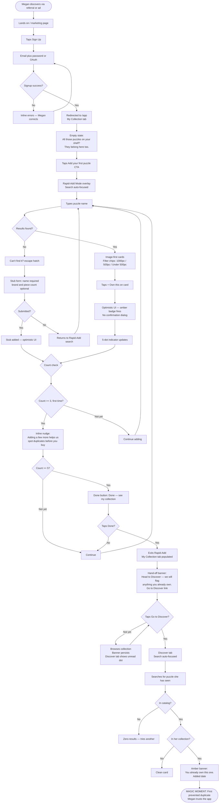

# UX Design Specification MyPuzzleInventory

**Author:** Andrew
**Date:** 2026-05-20

---

<!-- UX design content will be appended sequentially through collaborative workflow steps -->

## Executive Summary

### Project Vision

MyPuzzleInventory is the canonical catalog and collection tracker for serious jigsaw puzzle collectors — "the Discogs of jigsaw puzzles." It is the first tool to combine a comprehensive, actively maintained puzzle database with duplicate-prevention UX and affiliate-integrated retailer routing in a single product built for the casual collector.

The product solves a specific daily pain: every time Megan sees a puzzle she might want, she pays a recurring emotional tax — relying on memory, a Notes app, or a screenshot folder to answer "Do I already own this?" MyPuzzleInventory is what she opens instead. The real retention hook is not the count of puzzles added, but the **first prevented duplicate purchase** — the moment the app catches something. That's the "aha." Five puzzles in the first session is the prerequisite that makes that moment possible.

Built as a side project targeting passive income at 10–20k MAU without outside investment.

### Target Users

**Primary — Megan, the 4-Shelf Collector**
Female, 34, owns 80+ puzzles, buys 1–3/month ($300–600/year). Follows puzzle Instagram accounts. Lurks on r/Jigsawpuzzles. Splits her wishlist across Pinterest, Notes app, and phone screenshots. Has accidentally bought duplicates. Puzzling is a ritual and identity, not a sport. She is encountered mid-scroll, on her phone, at 9:47pm, asking herself "do I already own this?" in a 9-second window of uncertainty.

**Secondary — Dan, the Competitive Puzzler**
Tracks completed puzzles to avoid repetition in timed practice. Served entirely by the Completed status on the same data model as Megan — no separate feature set required.

**Non-user (gift-giver as audience)**
Megan's mom: arrives via a shared public profile link, no account, needs to see Megan's wishlist and buy directly. Every gift-giver who lands on that page is a potential future Megan — this surface is a viral acquisition channel, not a tertiary output.

### Key Design Challenges

1. **The onboarding is "the first hunt," not a form.** Megan doesn't want to fill out a wizard — she wants to feel the relief of *found it* as fast as possible. The 5-puzzle threshold is the setup; the real design goal is engineering her first prevented duplicate purchase within the session. Catalog depth on the 4 anchor brands must be high enough that her first 3 searches almost certainly return results — no UX can paper over a catalog gap at this stage.

2. **Zero-results is a failure state first, retention moment second.** The Contribution Prompt only works if Megan already trusts the catalog enough to bother. The framing must feel like "you found a gap — you're the person who can fix it for everyone after you," not "fill out this form." Microcopy carries enormous weight here.

3. **Mobile-first duplicate check in under 10 seconds.** The primary use case is Megan on her phone mid-Instagram scroll. v1 is text-first (barcode scanner is v2). Every tap of friction on mobile is a conversion kill. The check-ownership flow is not a feature — it is the product.

4. **The public profile must work beautifully for non-users.** A gift-giver landing on `/u/megan` with no account must be able to see her wishlist and buy directly. Server-side rendering, direct affiliate buy links, and a note like "Megan doesn't own this yet" make this a referral engine.

### Design Opportunities

1. **Duplicate Warning as table stakes, not delight.** The warning needs to be proactive, fast, and unavoidable — surfaced in search results before the detail page, not just on it. Calling it "delight" risks underinvestment. It is the core promise of the product.

2. **The wishlist as a buying session.** Rather than a static list, the Wishlist page can function as an active buying assistant — surfacing what's in stock today, what changed in price, what's back from out-of-stock. This turns passive storage into an active revenue driver.

3. **The collection profile as identity artifact.** A visually compelling collection grid that Megan is proud to share drives organic word-of-mouth more than any feature. The Google Sheets cottage industry (paid templates on Gumroad) reveals revealed willingness to pay in this category — people do pay for puzzle organization when the tool is good enough.

## Core User Experience

### Defining Experience

The core experience is a single loop that must complete in under 10 seconds on mobile: Megan sees a puzzle (on Instagram, in a store, at a friend's house) → opens the app → types a title or partial description → sees results with ownership status inline → she either already owns it (the catch) or adds it to her Wishlist → done.

This loop is not onboarding, not social, not commerce. It is the daily-use case that makes every other feature viable. Everything else — wishlist management, affiliate buy links, public profiles — earns its place by supporting or extending this loop.

The core loop must work for a logged-out user returning from a browser bookmark on the first tap. Ownership badges ("In Your Collection", "On Wishlist") render as a second pass after fast anonymous search results load — this two-phase render keeps the experience fast for all users and personalised for authenticated ones, without requiring a login wall before search.

### Platform Strategy

- **v1:** Responsive web application, touch-first on mobile, keyboard-navigable on desktop.
- **Search:** Text-based only. No barcode scanner or image recognition in v1 (v2 roadmap). Search must be forgiving — fuzzy matching, partial title hits, and brand/piece-count filter chips as disambiguation tools. A near-miss is not a miss: "botanical" must surface "Garden Botanica."
- **Performance targets:** Search results <500ms p95; Affiliate Redirect <200ms p95; public puzzle page TTFB <300ms p95 (SSR required for SEO and social sharing).
- **Offline:** Not required for v1.
- **Native app:** v2 roadmap (React Native). The v1 web app is the primary surface; bookmark behaviour on iOS/Android home screen is sufficient for now.

### Effortless Interactions

- **Ownership check:** Zero friction from open-to-answer. Search is available from every page via a persistent header bar. Ownership badges appear inline on results without a separate navigation step.
- **Status actions (Own/Want/Completed):** One tap. Optimistic UI — the button state changes immediately before server confirmation. Pending state and error rollback must be explicitly designed; they cannot be afterthoughts on a slow mobile connection.
- **Buying from Wishlist:** One tap routes through the Affiliate Redirect to the lowest-price in-stock retailer. Opens in a new tab to preserve the Wishlist session.
- **Public profile for gift-givers:** No account required. Loads server-side rendered. Wishlist items have direct Buy buttons. The experience must be indistinguishable in quality from the authenticated view.

### Critical Success Moments

1. **The first result.** Megan's first search returns her puzzle. The catalog works. This moment must succeed for >85% of first searches on the four anchor brands — if it doesn't, no UX recovers the trust.

2. **The first catch.** She searches a puzzle she was about to buy and sees "In Your Collection" inline in the results — before she taps through, before she checks prices, before she considers buying. The UI must make her *feel* the avoided regret, not just display the information. This is the product's core promise delivered. It is the real Magic Moment, and the five-puzzle onboarding threshold exists only to make this moment possible.

3. **The first share.** She copies her profile URL and sends it to her mom. The profile loads beautifully without a login, the wishlist is visible, the Buy buttons work. Her mom has a frictionless gift-discovery experience. This moment is also the product's primary acquisition loop — every gift-giver who converts is a potential new Megan.

### Experience Principles

1. **Speed over completeness.** The duplicate check must reach an answer in under 10 seconds on mobile. Never make Megan wait or navigate to get the answer she came for. Fast anonymous results first; personalised ownership overlay second.

2. **The catch is the promise.** The duplicate warning surfaces inline in search results — not only on the detail page. It is table stakes, not a delight feature. Underinvesting here is the single highest-risk UX mistake in the product.

3. **A near-miss is not a miss.** Search must surface fuzzy matches, partial title hits, and brand/piece-count filtering. Megan often doesn't know the exact title. A query that returns zero results when a close match exists is a trust-kill on first use.

4. **One tap, then out.** Every core flow resolves cleanly and quickly. The product is optimised to let Megan leave satisfied — not to keep her engaged. This is the rarest instinct in product design and the right one for this use case.

5. **The profile works for strangers.** The public profile is the best-looking surface in the product. Its data model is locked now: collection grid, wishlist with buy links, basic stats. No scope creep after the fact. Every anonymous page load runs a server-side query — keep it lean.

## Desired Emotional Response

### Primary Emotional Goals

**Relief** is the dominant emotion — and it is load-bearing. Everything else (Confidence, Pride, Vindication) is downstream of it. If Megan never gets the catch, she has no story to tell and word-of-mouth never starts. Relief is not a feature; it is the product's entire emotional contract.

**Vindication** is the missing emotion the synthesis initially overlooked, and it may be the strongest word-of-mouth driver for early adopters. The puzzle collector community has been paying for Google Sheets templates because no good app existed. They are underserved and they know it. When MyPuzzleInventory works the way Megan always needed it to work, the response is not just relief — it is *"I knew this should exist. I wasn't wrong to want this."* People who feel vindicated become evangelists. The first successful catch should feel like a small ceremony that acknowledges: yes, this is exactly what you needed.

**Confidence** builds over time, but it is specifically *confidence in her data* — not the app generally. A user can trust the UI while still feeling uncertain because she hasn't entered all 80+ puzzles yet. The onboarding design targets this: every puzzle added visibly grows her collection, reinforcing that the data is accurate and hers.

**Pride** in the public profile is a plausible emotional target borrowed from adjacent hobbies (Letterboxd, Goodreads, Discogs) but is not yet evidenced directly in the puzzle collector community. The design should support it — an image-first gallery, not a spreadsheet — but should not over-invest in it until usage signals confirm that Megan shares her profile organically.

### Emotional Journey Mapping

| Stage | Target emotion | Emotion to avoid |
|---|---|---|
| First discovery / signup | Intrigue, low friction | Skepticism ("another app that won't have my puzzles") |
| First search, result found | Relief + small triumph | Anxiety about catalog gaps |
| First catch ("you already own this") | Visceral relief + Vindication — *avoided regret* | Flatness (just seeing text without feeling the save) |
| Onboarding (adding first 5 puzzles) | Momentum, satisfying progress | Obligation, form-filling fatigue |
| Wishlist buy flow | Confidence, permission to buy | Distrust of affiliate links |
| Sharing profile | Pride, identity expression | Embarrassment (profile looks bad to the gift-giver) |
| Zero results / catalog gap | Contribution agency ("I can fix this for everyone") | Betrayal (silent failure — app didn't warn her, she bought a duplicate anyway) |
| Returning session | Habit, comfort, familiarity | Re-authentication friction |
| Long-term use | Trust in data permanence | Platform shutdown fear ("will this exist in 18 months?") |

**Critical note on catalog coverage:** The entire emotional map is contingent on launch catalog depth. A zero-results response where the puzzle *is* in Megan's collection but not in the catalog is not a zero-results UX problem — it is a broken promise that registers as betrayal. The onboarding must communicate catalog scope clearly so Megan's expectations are calibrated before her first search, not shattered by it.

### Micro-Emotions

**The catch must feel like a save, not a lookup.** Two versions exist:

- *Version A (The Lookup):* A small checkmark. Text: "In Collection." Megan thinks "oh good" and closes the app. Emotionally: 2/10. She uses the app again but never tells anyone.
- *Version B (The Save):* The result card shifts into a warmer visual register. Human-language copy: "You have this one" — not "In Collection." One contextual detail she didn't expect: "Added 8 months ago." The app *remembers her life*, not just her list. Megan exhales. That exhale is the product.

The owned state needs a micro-story, not a visual flag. Even a single line of contextual data (date added) transforms recognition from database output into personal memory. This requires that `date_added` be stored on the User Puzzle record and surfaced on the owned state — a data model decision with emotional design implications.

**Momentum in onboarding.** Each puzzle added should feel like building something. A running count ("You've added 3 puzzles") and a growing visual grid — not a progress bar. She is constructing a collection, not completing a form.

**Permission in shopping mode.** Megan has two emotional modes: *cataloger* (relief, confidence, vindication) and *buyer* (discovery, anticipation, permission). The wishlist and browse flows serve buyer mode. The positive emotional target here — "it's okay to buy this one because I know what I have" — should be surfaced subtly on the Wishlist page and the puzzle detail page for Wanted items.

**Trust in data permanence.** Platform shutdown fear is documented in the puzzle community and is a distinct threat from catalog completeness skepticism. Users are asking "will this app exist in 18 months?" The design response: CSV export visible and prominent (not buried in settings), open format documentation linked from the export, "your data is yours, always" as explicit product copy.

### Design Implications

| Emotional target | Design response |
|---|---|
| Relief — the catch | Inline ownership badge in search results; distinct warm visual register for owned state; human copy ("You have this one"); date-added contextual line |
| Vindication — first catch | Treat the first successful ownership check as a ceremony, not a toast. Acknowledge the moment explicitly |
| Confidence in data | Running count + growing grid in onboarding; collection stats header showing total puzzles, brands, piece count |
| Trust in permanence | CSV export on profile page (not just settings); "your data is yours" in onboarding and product copy |
| Permission in shopping mode | Wishlist page frames items as "ready to buy"; duplicate warning on detail pages creates implicit permission for non-owned items |
| Pride in profile | Image-first collection grid; cover art is the content; clean layout that renders well in a shared link preview |
| Contribution agency (zero results) | "We don't have this puzzle yet — you can be the first to add it" framing; not "Not found." |

### Emotional Design Principles

1. **Relief before delight.** The duplicate check must work reliably before any other emotional design investment is made. One failed check that lets a duplicate through does more emotional damage than ten successful ones build trust.

2. **Human language over database language.** "You have this one" not "In Collection." "Added 8 months ago" not a timestamp. Every string that surfaces collection data should read as the product speaking to Megan, not reporting to her.

3. **Vindication is the word-of-mouth engine.** Early adopters who feel "someone finally built this right" become evangelists. Design the first-catch moment to honour that feeling — briefly, without fanfare, but unmistakably.

4. **Permanence is trust.** Data export must be visible, not buried. "Your data is yours" is not a privacy policy footnote — it is a primary emotional reassurance for a community that has been burned by app shutdowns before.

## UX Pattern Analysis & Inspiration

### Inspiring Products Analysis

**1. Discogs — Architecture blueprint**
The canonical "release page + personal collection layer" architecture is the direct model for MyPuzzleInventory. Every vinyl record has a shared canonical page; users attach their personal ownership data to it. This is exactly the Puzzle / User Puzzle data model. Discogs also proves that inline collection status in search results (the "Have / Want" signal at browse time) is load-bearing for the ownership-check use case — it must be ambient, not a navigation step. What does *not* transfer: Discogs's desktop-heavy collection management UI is brutal on mobile, their rigid substring search is an anti-pattern we reverse, and marketplace mechanics are irrelevant at launch.

**2. Letterboxd — Profile and identity model**
The grid of film posters *is* the identity — users don't describe their taste, they display it. Box art must be first-class data from day one; without it the profile becomes a spreadsheet. Key steals: the diary/log pattern (date added becomes "when did this puzzle enter my life?"), and the quiet flex of the item count on the profile ("47 puzzles" as an achievement, not a row count). What does *not* transfer: Letterboxd's value is the *opinion* (reviews, ratings, social feed). MyPuzzleInventory's value is the *confirmation*. Build the profile without the social graph. Do not add reviews because Letterboxd has them.

**3. Goodreads — Onboarding pattern and language model**
Steal: the "Want to Read" button — one tap, low commitment, present-tense desire language. Recognition-over-recall onboarding (rate/add from a prompted list, not a blank search). Structural slot for "friends who own this" (don't build it in v1, but don't design it out). Avoid: Goodreads's edition disambiguation failure is the exact risk for puzzles — "Ravensburger Eiffel Tower 1000" exists in multiple editions. Disambiguation must happen at the results level, not buried in a tab. Avoid: their shelf/list complexity creates maintenance anxiety; keep statuses to Own / Want / Completed and resist adding more.

**4. Duolingo — First-win ceremony**
Duolingo solved the precise problem of getting a new user to their first meaningful moment of success before they bounce. The gap between "completed an action" and "felt rewarded for completing an action" is where retention lives. The first add to collection is the hinge moment. Study how Duolingo handles the empty-state-to-first-item transition — not the ongoing streak gamification, just that single ceremonial beat. A brief pulse, a growing thumbnail in a collection strip, a line of human copy: "Added. 47 puzzles now." That's the first-win ceremony.

**5. IPDb (competitor) — The anti-pattern museum**
IPDb has 39,000+ puzzles and a community, yet fails Megan at every critical moment. Concrete failures to counter:
- Desktop layout squeezed into mobile; no thumb-zone awareness
- Emoji-heavy navigation — works at small scale, breaks at 39k items; counter with text-anchored hierarchy
- No box art as default — text-forward is fatal for a visual physical product
- No duplicate-prevention UX — has the data, does nothing with it at point of decision
- No dark mode — table stakes for a mobile-first app in Instagram's ecosystem
- No commerce layer (structurally cannot add one as a non-profit)
- Sparse database complaints in early reviews — signal catalog confidence explicitly at launch

### Transferable UX Patterns

**Navigation patterns:**
- Persistent search bar in header on every page (Discogs) — ownership check must be reachable from anywhere without navigation
- Text-anchored filters with visual accents, not emoji-primary navigation (anti-IPDb)
- Edition/variant disambiguation at results level, not in a separate tab (anti-Goodreads failure mode)

**Interaction patterns:**
- Inline owned/wanted status on search result cards — ambient, no extra tap (Discogs "Have/Want" at browse time)
- One-tap status toggle with optimistic UI — immediate visual feedback, roll back on error (Discogs collection toggle)
- Add-to-collection ceremony on first item — brief animation or confirmation that registers the emotional beat (Duolingo first-win)
- "Want to Read" pattern for Wishlist — present-tense desire language ("Want this"), one tap, low commitment (Goodreads)

**Visual patterns:**
- Image-first catalog cards — box art leads, text below (anti-IPDb, Letterboxd model)
- Collection grid on profile — art tiles as identity display, not a data table (Letterboxd)
- Item count as quiet achievement — "47 puzzles" displayed as a number worth earning, not a database row count (Letterboxd)
- Dark mode support from Day 1 — not a later iteration (anti-IPDb competitive counter-position)

### Anti-Patterns to Avoid

- **Review/rating system** — Letterboxd's value is opinion; ours is confirmation. Don't build it because Letterboxd has it.
- **Social feed or follower graph** — the public profile is a sharing artifact, not a social network. v1 does not need follows, likes, or activity feeds.
- **Community edit UI before community exists** — Discogs crowdsourcing requires millions of users. At launch, catalog is curator-maintained. Build the infrastructure capable of community editing later; don't design moderation UX for a community that doesn't exist yet.
- **Emoji-primary navigation** — degrades at catalog scale; confuses at 5k+ items.
- **Status complexity** — Own / Want / Completed is the right set. Every status added is a state Megan might feel guilty about not maintaining.
- **Edition disambiguation buried in a tab** — multiple puzzle editions must be surfaceable from results, not hidden one level deeper.

### Design Inspiration Strategy

**Adopt directly:**
- Discogs canonical item page + personal collection record architecture
- Discogs inline collection status in search results
- Letterboxd image-first profile grid
- Goodreads one-tap desire-language wishlist button
- Duolingo first-win ceremony on first collection add

**Adapt for context:**
- Letterboxd diary entry → date-added contextual line on owned puzzle card ("You have this one — added 8 months ago")
- Goodreads recognition-over-recall onboarding → search-and-confirm wizard (not rating from a list, but surfacing likely-owned puzzles from anchor brands to seed the first session)
- Discogs "Have/Want" inline badge → "In Your Collection" / "On Your Wishlist" with human language and warm visual register for the owned state

**Explicitly reject:**
- IPDb's desktop-first layout, emoji navigation, text-forward catalog cards
- Goodreads's edition-agnostic search results
- Letterboxd's social graph, reviews, ratings (for v1)
- Any onboarding that asks for data before showing value

## Design System Foundation

### Design System Choice

**shadcn/ui + Tailwind CSS + Framer Motion**

- shadcn/ui for composable, owned UI components (built on Radix UI primitives)
- Tailwind CSS for utility-first styling and semantic design tokens
- Framer Motion for animation (first-add ceremony, toggle transitions, hover states)
- next-themes for dark mode persistence across SSR/CSR boundaries

### Rationale for Selection

1. **Solo developer on a 10-week timeline** — shadcn/ui + Tailwind is the most productive path for a single developer who needs to move fast without fighting the framework. No library lock-in risks, no version mismatch surprises on Vercel.
2. **Image-first visual direction is natural in Tailwind** — `aspect-square`, `object-cover`, `overflow-hidden` handles puzzle box art at every proportion without custom CSS.
3. **Semantic color tokens map directly to emotional design** — `brand-owned` (warm amber) and `brand-wanted` (cool blue-slate) are defined once in `tailwind.config.ts` and propagate to every component that needs to express ownership state. The warm/cool emotional contrast is achievable without fighting the system.
4. **Dark mode is first-class** — Tailwind's `dark:` variant with `class` strategy and `next-themes` gives dark mode in one afternoon, before any feature components are built. Direct counter-position vs. IPDb Day 1.
5. **Radix UI primitives** — accessible modals, dropdowns, toasts and focus management are handled at the primitive level without building them.
6. **Framer Motion for load-bearing animation** — the first-add ceremony (Duolingo model), one-tap toggle satisfaction, and card hover states require animation vocabulary beyond Tailwind's built-in utilities. Framer Motion is added to the stack now, not bolted on later.
7. **Next.js App Router native** — all three libraries are built for or compatible with the App Router + Vercel pipeline. No special configuration required.

### Implementation Approach

**Critical sequencing — must be done in this order before any feature components:**

1. `npx shadcn@latest init` (CSS variables strategy, TypeScript)
2. Install `next-themes`; add `ThemeProvider` to `app/layout.tsx` with `suppressHydrationWarning` on `<html>` (omitting this causes a hydration mismatch on every page load)
3. Define 4 semantic color tokens in `tailwind.config.ts` and `app/globals.css` with both light and dark variants
4. Configure `next.config.ts` `images.remotePatterns` for puzzle image CDN domains
5. Commit `components/ui/` to git as a baseline snapshot (generated files — never hand-edit)
6. Add `framer-motion` to dependencies
7. Write first failing test: `puzzle-card.test.tsx` — renders with owned ring / renders without it

**File structure convention:**
```
components/
  ui/          ← shadcn generated — do not hand-edit
  puzzle-card.tsx     ← composition layer (owned/wanted/skeleton states)
  ownership-badge.tsx ← semantic token usage
  search-bar.tsx      ← 'use client', must be wrapped in <Suspense>
```

**Two-phase render architecture:** Server Component fetches public puzzle data (no auth) → Client Component overlays ownership badges as an authenticated second pass. The `'use client'` boundary goes at the grid level, not the card level. Initial HTML is server-rendered and SEO-indexable.

### Customization Strategy

**4 semantic color tokens — the entire emotional palette:**

```css
:root {
  --brand-neutral:     220 14% 96%;
  --brand-owned:       35 91% 62%;   /* warm amber — the catch state */
  --brand-wanted:      217 91% 60%;  /* cool blue — anticipatory */
  --brand-destructive: 0 84% 60%;
}
.dark {
  --brand-neutral:     220 14% 11%;
  --brand-owned:       35 91% 55%;
  --brand-wanted:      217 91% 55%;
  --brand-destructive: 0 84% 55%;
}
```

**Component override discipline:** Every shadcn/ui component touching a puzzle card (Card, Badge, Button) must have its default styles overridden with brand tokens before launch. shadcn's defaults are clean but corporate — without intentional overrides the app risks feeling like a SaaS dashboard rather than a collector's product. A token audit pass is required before soft launch.

**Known complexity areas requiring extra design attention:**
- Profile gallery grid: responsive masonry layout where portrait and landscape box art coexist may require custom CSS grid beyond Tailwind utilities — plan the layout early
- Warm card glow for owned state: `shadow-[0_0_0_2px_theme(colors.brand-owned)]` with subtle outer glow — document the pattern once and reuse
- `useSearchParams` in the persistent search bar requires `<Suspense>` wrapper — known Next.js 14 footgun

## Core User Interaction

### Defining Experience

> **"Search for a puzzle and instantly know you already own it — before you spend $35 on a duplicate."**

The defining experience is the **ownership check** — the 9-second loop from "I see a puzzle I might want" to "I know exactly where I stand." Everything else in the product earns its place by supporting or extending this loop. If this interaction fails, nothing else recovers it.

### User Mental Model

Megan arrives with a **memory + partial information** mental model. She currently solves this by opening a Notes app, scrolling through screenshots, or guessing. She expects the app to behave like a very fast, smart version of that — type what she remembers, get a confident answer. She does not expect to browse or filter first. She arrives with a fragment ("the botanical Ravensburger," "White Mountain candy," "1000 piece farm") and expects the system to meet her there.

**Current frustrations with existing solutions:**
- Zero results when the puzzle is real (catalog gap)
- Ambiguous results with no way to tell which edition is hers
- Having to navigate to a detail page just to see ownership status
- Login walls before search resolves her immediate question

**Unauthenticated user flow (must be explicitly designed):** Search must work without authentication — a login wall kills the defining experience at its most critical moment. Unauthenticated users see full search results with no ownership badges (all cards render `ownershipStatus: 'none'`). Tapping "Want it" surfaces a lightweight login prompt that preserves their search context and returns them to the same result after auth.

### Success Criteria

1. **Speed:** Result appears within 500ms of the debounce firing on mobile. The wait is imperceptible.
2. **Recognition:** Correct puzzle appears in the top 3 results with a partial, fuzzy, or imprecise query. Minimum 4-character threshold before search fires (prevents visual thrashing on short strings). 1-character typo transposition still returns correct puzzle in top 3.
3. **Immediacy:** Ownership status is visible *on the result card* — no tap required to see "You have this one."
4. **Confidence:** The visual treatment of the owned state registers as a meaningful signal without reading carefully. Brand name and piece count shown prominently on the card so the user can self-verify in under 3 seconds (guards against false-positive catalog mismatches).
5. **Recovery:** Zero-results state shows "We don't have this one yet — want to add it?" inline — not a dead end, an invitation.
6. **Ownership is mutable:** A "Remove from collection" action is available. A user who gifts or sells a puzzle must be able to remove it.

### Novel vs. Established Patterns

This is an **established pattern executed better** — not a novel interaction. Search is universal; no user education required. The innovation is in two specific places:
1. Inline ownership status on result cards (no comparable product does this for puzzles)
2. The emotional register of the owned state: human language + warmth + micro-story vs. database label

### Experience Mechanics

**1. Initiation**
- Persistent search bar in header on every page
- Tap-to-focus on mobile brings keyboard immediately — no extra tap
- Placeholder: "Search puzzles…"
- Minimum 4-character threshold before search fires; last 20 queries cached in memory (repeat query = instant, no debounce)

**2. Interaction — Two-Phase Render**
- Results debounced at 300ms as user types
- **Phase 1 (anonymous, fast):** Results render with box art, title, brand, piece count. Ownership badges show loading skeleton ring.
- **Phase 2 (authenticated overlay, ~200ms later):** Ownership status resolves in place — no list re-render.
- Owned: warm amber ring + "You have this one" (copy to A/B test vs. "Got it.")
- Wanted: cool blue ring + "On your wishlist"
- No status: neutral + one-tap "Want it" button

**3. Feedback — The Amber Animation Sequence**

The owned state must feel like *recognition*, not a database result:

1. Card enters (skeleton → content): `translateY(8px → 0)` + fade, 200ms ease-out. All cards, no distinction yet.
2. **80ms deliberate beat** — owned card sits neutral. Makes the glow feel discovered, not pre-assigned.
3. Amber ring **blooms in**: opacity 0→1, scale 0.95→1.0, 180ms ease-out. One confident pulse.
4. Label fades in **40ms after** the ring — visual signal registers before language confirms.
5. Warm ambient shadow: `box-shadow: 0 0 12px 2px rgba(amber, 0.35)` — incandescent, not neon.

Total animation budget: ~320ms card-load to label-settled. Imperceptible as animation; registers as quality.

Loading state: skeleton cards at correct aspect ratio — no spinner, no layout shift.

**4. Completion**
- **Owned:** She sees "You have this one" — closes the app. Task complete. Relieved.
- **Not owned:** One-tap "Want it" from the result card — no navigation required. Optimistic UI.
- **Not in catalog:** "We don't have this one yet — want to add it?" with one-tap contribution action.
- **Exit:** She returns to Instagram/the store. The app resolved her question and let her go.

### Acceptance Criteria

| AC | Criterion |
|---|---|
| AC-SEARCH-01 | Input to first result visible ≤ 500ms p95 on mobile |
| AC-SEARCH-02 | Debounce 300ms; only 1 network call for a 5-character burst typed in 200ms |
| AC-SEARCH-03 | Phase 1 (anonymous results) renders within 300ms of debounce firing |
| AC-SEARCH-04 | Phase 2 (ownership overlay) completes within 200ms of phase 1 |
| AC-SEARCH-05 | 1-character typo transposition returns correct puzzle in top 3 |
| AC-SEARCH-06 | Zero results renders inline contribution prompt; CTA links to `/puzzles/add?prefill={query}` |
| AC-SEARCH-07 | Unauthenticated: phase 2 never fires; all cards show `ownershipStatus: 'none'` |
| AC-SEARCH-08 | Amber ring meets WCAG AA contrast on light and dark backgrounds |
| AC-SEARCH-09 | ESC clears query and returns focus to input |
| AC-SEARCH-10 | Results close on outside click and route change |

## Visual Design Foundation

### Color System

No existing brand guidelines. Visual direction derived from the collector audience (Piecework/Galison benchmark), emotional targets, and competitive positioning vs. IPDb.

**The benchmark question:** Does this feel like it belongs on the same shelf as a Piecework box? Muted editorial palettes, clean breathing room, box art as the designed object. The UI must recede; the puzzle art must be the hero. Bold *structure* (layout, hierarchy) is safe. Chromatic noise that competes with box art is not.

**Dark mode leads.** Puzzle collecting is an evening and weekend ritual. IPDb's lack of dark mode was a documented community complaint. This is non-negotiable from Day 1.

#### Dark Mode Palette

| Token | Name | HSL Value | Purpose |
|---|---|---|---|
| `--background` | Void Walnut | `hsl(24 8% 8%)` | Dark brown-charcoal, warm not cold |
| `--surface` | Card Felt | `hsl(24 6% 12%)` | Card and panel background |
| `--surface-raised` | Lifted | `hsl(24 5% 16%)` | Hover state, modal backdrop |
| `--border` | Hairline | `hsl(24 5% 22%)` | Subtle, breathing room |
| `--foreground` | Warm White | `hsl(36 20% 92%)` | Body text — warm, not clinical |
| `--muted-foreground` | Dust | `hsl(30 8% 55%)` | Secondary text, timestamps, captions |

Body text in dark mode: `#F0EDE8` (warm off-white). Never pure `#FFFFFF` — causes halation, breaks the sanctuary warmth.

#### Light Mode Palette

| Token | HSL Value |
|---|---|
| `--background` | `hsl(36 25% 97%)` — warm paper, not hospital white |
| `--surface` | `hsl(36 20% 93%)` |
| `--foreground` | `hsl(24 15% 12%)` |
| `--muted-foreground` | `hsl(24 8% 42%)` |

#### Brand / Semantic Tokens

| Token | HSL Value | Usage |
|---|---|---|
| `--brand-owned` | `hsl(38 85% 55%)` | Warm amber — the catch state, lit from within |
| `--brand-wanted` | `hsl(210 70% 60%)` | Cool blue — wishlist, anticipation |
| `--brand-neutral` | `hsl(24 5% 40%)` | Uncategorized state |
| `--brand-destructive` | `hsl(0 65% 55%)` | Delete, warnings |

**Owned state glow:**
```css
box-shadow: 0 0 0 2px hsl(38 85% 55%), 0 0 12px 2px hsl(38 85% 55% / 0.35);
```
The 35% outer glow is the difference between a sticker and a lantern.

**Shadows are warm, not cool:**
```css
--shadow-card:   0 2px 8px  hsl(24 20% 4% / 0.4);
--shadow-raised: 0 8px 24px hsl(24 20% 4% / 0.5);
```

### Typography System

Typography in an image-first app is like the placard next to a painting in a gallery. The painting is the star. The placard whispers what it needs to, then gets out of the way.

#### Typefaces

**Display / Headings: Fraunces** (Google Fonts, variable)
A variable optical-size serif with warm, handcrafted quality — ink-trap details, a "wonk" axis that gives letterforms an artisanal feel. Reads "collector's shelf," not "startup dashboard." Megan follows puzzle illustrators; she responds to craft. Use for: page titles, puzzle name on detail pages, collection hero stats, milestone moments.
```css
font-family: 'Fraunces', Georgia, serif;
font-variation-settings: 'opsz' 144, 'wght' 600, 'WONK' 1;
```

**Body / UI: Inter** (Google Fonts, variable)
The workhorse — neutral, legible at 14px on a phone screen in dim light, holds weight across dark mode contrast ranges. Brain doesn't spend cognitive energy parsing it. Alternative: DM Sans (slightly warmer/friendlier geometry; swap if the overall palette feels too cool).
```css
font-family: 'Inter', system-ui, sans-serif;
```

**Numeric metadata (piece counts): JetBrains Mono** (optional, Google Fonts)
Narrower and warmer than Roboto Mono. Use for piece count values to keep digits in tabular alignment.

#### Type Scale

Based on a **major third modular scale** (ratio 1.250), anchored at 16px base. Fluid scaling with `clamp()` for display/heading levels; body text is fixed.

| Token | Role | Size | Weight | Font |
|---|---|---|---|---|
| `display` | Hero / page title | `clamp(1.953rem, 8vw, 3.052rem)` | 300 | Fraunces |
| `h1` | Section header | `clamp(1.563rem, 6vw, 2.441rem)` | 400 | Fraunces |
| `h2` | Card group header | `1.953rem` | 400 | Fraunces |
| `h3` | In-page section | `1.563rem` | 500 | Inter |
| `h4` | Label header | `1.250rem` | 600 | Inter |
| `body-lg` | Lead paragraph | `1.125rem` | 400 | Inter |
| `body` | Default body text | `1rem` (fixed) | 400 | Inter |
| `body-sm` | Secondary body | `0.875rem` | 400 | Inter |
| `caption` | Card metadata, timestamps | `0.75rem` | 400 | Inter muted |
| `label` | Form labels, tags | `0.75rem` | 600 | Inter |

**Hard floor: 0.75rem / 12px on all text, all contexts.** Dark mode causes letterforms to bloom — small text looks thinner than it is. Never go below 12px.

#### Line Heights

| Context | Line Height |
|---|---|
| Display / H1 | 1.1 (short labels, editorial tight) |
| H2 / H3 | 1.2 |
| H4 / UI labels | 1.3 |
| Body | 1.6 (narrow mobile column — give the eye a thread) |
| Caption | 1.4 |

#### Typography Working Around Images

- **The undercard rule:** Title, brand, and piece count live *below* the image — never overlaid on box art. The art is the identity of the puzzle; text overlays break that.
- **When overlay is unavoidable** (hero banners, collection headers): scrim pattern — gradient `rgba(0,0,0,0)` top to `rgba(0,0,0,0.6)` bottom. White text, weight 600+, `text-shadow: 0 1px 3px rgba(0,0,0,0.4)`. Never use overlay for critical information.
- **Color contrast as a moving target:** Because box art is unpredictable, critical metadata (title, piece count, status) always lives outside the image bounds where contrast is controlled.

### Spacing & Layout Foundation

**Base unit:** 4px. Spacing scale: 4, 8, 12, 16, 24, 32, 48, 64, 96.

**Layout metaphor: the collection shelf.** Megan is browsing her collection the way you browse a bookshelf or a record crate — the grid *is* the UI.

#### Card System

| Property | Value | Reasoning |
|---|---|---|
| Mobile aspect ratio | `2:3` | Portrait — like a puzzle box standing upright |
| Desktop aspect ratio | `3:4` | Slightly wider, comfortable at larger scale |
| Mobile card width | `calc(50vw - 20px)` | Two across — portfolio browsing, not product catalog |
| Desktop grid | `repeat(auto-fill, minmax(200px, 1fr))` | Responsive collector-shelf density |
| Card gap (mobile) | `12px` | Tight enough to feel curated |
| Card gap (desktop) | `16px` | |
| Card padding | `16px` | Generous, not wasteful |
| Border radius | `8px` | The corner of a puzzle box |
| Status pill radius | `9999px` | Pill shape for "Completed," "In Progress" only |

#### Layout Density

Generous negative space signals quality to this audience — it's what Piecework and Galison do. Text-dense was the documented IPDb complaint. The antidote is breathing room. White space (or dark-space) is not waste — it is the frame.

### Accessibility Considerations

- All text meets WCAG AA contrast ratios (minimum 4.5:1 for body, 3:1 for large text)
- Owned amber ring (`hsl(38 85% 55%)`) verified WCAG AA against both `--background` dark and `--surface` light
- Status is never communicated by color alone — owned/wanted states include text labels alongside color/ring
- 12px hard minimum on all text, all contexts
- Touch targets minimum 44×44px on all interactive elements
- Keyboard navigation: all interactive elements reachable via Tab; focus ring visible in both light and dark modes

### Motion Principles (Framer Motion)

Three rules for animation in this product:

1. **Deliberate, not bouncy.** Default transitions: `ease-out`, 200–300ms. This is a sanctuary, not a game.
2. **The owned-state ceremony.** When a puzzle transitions to owned: amber ring scales 0.8→1.0 with a 400ms spring, glows once. That's the micro-ceremony — not a loop.
3. **The collection assembles.** Grid items on load stagger with 30ms delay per card: `fade` + `translateY(8px → 0)`. The collection builds itself, like pieces joining a puzzle.

---

## Design Direction Decision

### Design Directions Explored

Six distinct visual directions were generated and evaluated across five collaborative review rounds, each applying the locked design system (Fraunces + Inter, dark walnut palette, amber owned / blue wanted) to different information architectures:

| # | Direction | Primary Metaphor | Homepage Surface |
|---|-----------|-----------------|-----------------|
| 1 | The Gallery | Image-dominant 4-col grid | Box art grid |
| 2 | The Library | Dense metadata list | Search bar + list rows |
| 3 | The Shelf | Netflix-style horizontal rows | Editorial brand lanes |
| 4 | The Dashboard | Stats hero | Owned/Wanted/Completed counts |
| 5 | The Finder | Search as entire homepage | Single search input |
| 6 | The Collection | Collection grid as primary | My Collection grid + tabs |

Full interactive mockups available at `_bmad-output/planning-artifacts/ux-design-directions.html` (keyboard shortcuts 1–6 to navigate; Compare All overlay for side-by-side analysis).

### Chosen Direction

**Hybrid: The Finder + The Gallery, with routing architecture separating marketing from product.**

The "homepage vs. authenticated experience" debate was resolved by recognizing it was an unacknowledged routing question, not a product strategy debate:

| Route | Surface | Primary Audience |
|---|---|---|
| `/` | Static marketing page (SEO, acquisition) | Cold traffic, first-time visitors |
| `/app` (default tab: Discover) | The Finder — search-first authenticated shell | Megan doing a duplicate check |
| `/app` (tab: My Collection) | The Gallery — collection grid, amber/blue status | Megan browsing her collection |
| `/puzzle/[id]` | Puzzle detail page (server-rendered, SEO) | Any visitor, gift-givers, SEO |
| `/u/[username]` | Public profile (server-rendered) | Gift-givers arriving via shared link |

**MVP implementation:** Tab-toggle on a single `/app` route (Discover + My Collection tabs) rather than separate routes. Graduated to separate routes in v2 once the tab-model is validated. This eliminates the two-phase render duplication risk, ownership state sync complexity, and halves the component count.

**Ownership state management (non-negotiable):** React Query for global cache invalidation. Status mutations (Own/Want/Completed toggles) must be optimistic and reflect immediately in both tabs. If the toggle lies, the product lies.

### Design Rationale

**Why The Finder as the default authenticated tab:**
- Megan's primary trigger is mid-Instagram-scroll, cold-open, specific intent — a Shazam moment, not a browsing moment
- Search-first is the only entry point that doesn't ask her to do extra work before completing her primary job
- Mary (analyst): "The Finder is the only direction that was designed around that use case as the entry point rather than retrofitting it"
- Default to Discover on first install; remember last active tab thereafter

**Why The Gallery as the collection tab (not the homepage):**
- Image-first grid is the identity artifact Megan shares and is proud of
- Every blue "wanted" card is a latent affiliate buy link
- Works at collection density (80+ puzzles); weak for new users (10–15 puzzles) as a homepage
- As a navigated-to surface it serves browsing mode without blocking the lookup entry point

**Why The Dashboard and The Shelf were rejected for MVP:**
- The Dashboard optimizes for a feeling (stats pride) rather than a behavior (duplicate check, affiliate click). Stats belong in the Profile tab, not above the fold.
- The Shelf requires ongoing content curation to feel alive — a solo developer liability. It's a month-9 direction, not month-1.

**Why separate routes for `/` and `/app`:**
- `/` serves Context D (cold organic traffic, SEO, acquisition) — a static marketing page
- `/app` serves Context A/B (Megan doing lookups, Megan browsing her collection) — an authenticated product shell
- Authenticated users hitting `/` get a middleware redirect to `/app/search` (two lines on Vercel)
- Attempting to make `/` serve both contexts creates a split-render surface, complicates caching, and makes it do two jobs badly

### Implementation Approach

#### Authenticated App Shell (`/app`)

**Tab structure:**
- Tab 1: **Discover** — The Finder search experience (default on first session)
- Tab 2: **My Collection** — The Gallery visual language, 3-col mobile grid
- Tab labels use the mental model vocabulary, not feature names

**Search (Discover tab):**
- Full-width search bar, auto-focused on tab activation
- Three quick-filter chips: `1000pc / 500pc / Under 500pc`
- pg_trgm search (`title % $1 OR title ILIKE $2`), results as image-first cards
- Two-phase render: Phase 1 anonymous (no auth required), Phase 2 ownership overlay
- URL-based search state (`useSearchParams`) with Suspense boundary (Next.js 14 requirement)
- Debounced 300ms with `AbortController` cancellation

**Collection (My Collection tab):**
- 3-col image-first grid, amber ring for owned, blue ring for wanted
- Filter bar: All / Owned / Wanted / Completed + Brand + Piece count
- Same `PuzzleCard` component as Discover tab (shared, not duplicated)
- Staggered grid load animation: 30ms delay per card, `fade` + `translateY(8px → 0)`

#### Puzzle Detail Page (`/puzzle/[id]`)

Server-rendered, SEO-indexed, works unauthenticated.

**Mobile layout — information hierarchy:**
```
← Back                        [Share]
PUZZLE IMAGE (16:9, full-width, tap to zoom)
─────────────────────────────────────────
[Brand name, muted]
[Puzzle Title — Fraunces, large]
[N pieces — Inter medium]
─────────────────────────────────────────
[ ✓ OWN ]    [ ♥ WANT ]    [ ★ DONE ]
─────────────────────────────────────────
Buy this puzzle
  [Amazon]        $24.99    In stock →
  [Target]        $27.99    In stock →
  [Puzzle Warehouse] $26.50 In stock →
  [Walmart]       —         Check →
─────────────────────────────────────────
↓ scroll: Details · Community stats
```

Desktop: two-column — image left (sticky, ~55%), right column has title/spec → toggles → buy links → details.

**Ownership toggles:**
- Three independent pill buttons (not radio buttons — Own + Completed can coexist)
- OWN active: amber fill. WANT active: blue fill. DONE active: soft completion state.
- If WANT tapped while OWN is active: brief tooltip "You already own this — still want another?" — then allow
- Optimistic UI throughout; server failure = rollback + snackbar

**Affiliate buy links:**
- Sorted by availability (in-stock first), never by affiliate rate
- No "Best price" badge — trust risk
- Stale/unavailable data: show dash for price, "Check store" for availability — never hide the row
- No auth wall on buy links whatsoever

**When user already owns it:**
- OWN toggle shows active (amber)
- Contextual inline banner between toggles and buy links: *"You own this puzzle — added [date]"* — amber-tinted, understated
- Buy links remain fully visible (gifting, second copy)
- No page overlay, no disabled UI — paternalism in UX is almost always wrong

**Unauthenticated visitor:**
- Toggles visible in ghost/default state with sub-label: "Tap to sign in and track your collection"
- Tapping any toggle opens a **bottom sheet** (not a redirect): Google / Email auth options
- After auth: bottom sheet dismisses, tapped toggle fires optimistically — user stays on puzzle page
- Buy links: always fully functional, no auth wall

#### Onboarding — Rapid-Add Mode

The onboarding flow is "the first hunt" — from empty state to first prevented duplicate purchase. Target: 5 puzzles added, then the duplicate check becomes statistically meaningful.

**Step 0 — Landing after account creation:**
Land on My Collection tab (not Discover). Empty state copy: *"All those puzzles on your shelf? They belong here too."* Single amber CTA: "Add your first puzzle →"

**Step 1 — Rapid-Add Mode (focused overlay on My Collection):**
- Auto-focused search bar, keyboard up immediately on mobile
- Three quick-filter chips: `1000pc / 500pc / Under 500pc`
- Results: image-first cards with single `+ Own this` amber button (full-width on card)
- **Single tap, no confirmation dialog, optimistic UI** — card immediately animates to amber Owned badge
- Progress: five dots at top (no numbered count — that's pressure)
- After puzzle #3: inline line appears: *"Adding a few more helps us spot duplicates before you buy"* — reveal the why only after investment

**Friction handling:**
- Can't find puzzle: "Can't find it?" escape hatch → minimal form (name required, rest optional) — stub entries beat blank walls
- Bored after 3: inline nudge: *"Two more and we'll start catching duplicates"*
- Hitting 5+: Done button label becomes "Done — see my collection" — exit with reward

**Step 2 — Hand-off to Discover:**
After Rapid-Add exit, a single amber-bordered inline banner on My Collection (not a modal): *"Your collection is taking shape. Head to Discover — we'll flag anything you already own. → Go to Discover"*

**Step 3 — First prevented duplicate:**
User searches in Discover. Matching card: amber banner replaces `+ Want this` button: **"You already own this one."** / *Added [date]*. This is the magic moment.

**North-star activation metric:** % of new users who trigger the duplicate warning in their first session. Not puzzles added, not DAU — did the product deliver on its headline promise before the user closed the tab?

#### Zero-Results Experience

**Search returns no results:**
- Heading: `Looks like "[search term]" isn't in our catalog yet.`
- Body: *"Every puzzle in our catalog started with someone like you. Tell us what you know about this one, and we'll do the rest. If you want, we'll let you know the moment it's added."*
- CTA: **"Help us add it"** (not "Submit a suggestion")
- Secondary: "Go back to search" (not "try again" — she didn't do anything wrong)

**Submission form — "Tell us about this puzzle":**

| Field | Label | Note |
|---|---|---|
| Required | **Puzzle name** | Pre-filled with search term |
| Optional | **Brand or publisher** | "Skip if you're not sure" |
| Optional | **Piece count** | "Approximately is fine" |
| Optional | **Photo of the box** | "A quick photo helps us match it faster" |
| Toggle (on by default) | **Let me know when it's added** | Retention hook — on by default |

Submit button: **"Save to my wishlist and submit"** — both outcomes named.

**Confirmation (inline, no navigation):**
> *Got it. We're on it.*
> "[Puzzle name]" is on your wishlist now — marked as coming soon. We'll send you a note the moment it's in the catalog.

**Pending wishlist card:**
- Same card shape as other wishlist cards — no visual demotion
- Status badge: **"Coming soon"** (amber)
- Sub-label: **"You found this one. We're working on it."**
- When it resolves: cover art replaces badge, transitional copy `Now in catalog ✓` fades out

**Notification when catalog entry goes live:**
- Subject: *"The puzzle you found? It's here now."*
- Body: *"You spotted the gap. [Puzzle name] is officially in the catalog — and it's already on your wishlist."*

#### Public Profile Page (`/u/[username]`)

Server-rendered. SEO-indexed. No auth required to view. Primary audience: gift-givers arriving via shared link.

**This is a conversion page disguised as a profile page.** Design it as a profile page and you get a vanity showcase. Design it as a conversion page and you get revenue and acquisition.

**Mobile layout — above the fold:**
```
[Avatar 56px]  Megan P.  @meganp
84 owned · 12 wanted · 31 done

[ 🎁 Wishlist (12) ]  [ Collection (84) ]
   ← pre-selected tab

[Puzzle card 1]
[Puzzle card 2]
...
```

Wishlist tab is pre-selected. Gift-givers never have to make that choice. No bio, no social links, no vanity above the fold.

**Wishlist card anatomy (designed for non-collectors):**
```
[Image 3:4]
Puzzle Name          ← Fraunces, warm white, 2 lines max
by Ravensburger      ← muted, smaller
[1,000 pcs] [~8–12 hrs]  ← amber badge + time estimate derived from piece count
[Buy on Amazon]      ← full-width, amber fill
[Buy on Puzzle Warehouse]  ← outline, secondary
```

Time estimate (`~8–12 hrs` derived from piece count) is gift-giver language, not collector language. It answers "is this casual or serious?" and costs nothing to render.

Buy links on the card face — no modal, no detail page. A gift-giver taps image, confirms, taps Buy. Done.

**Page hierarchy:**
1. Name + one-liner (small)
2. Wishlist — full width, immediately scannable, buy links on cards
3. Collection stats — brief, credibility-building
4. Full collection — below the fold, for collectors who dig
5. Acquisition CTA — anchored bottom or scroll-triggered

**Acquisition moment:**
A sticky footer strip that appears after any buy-link tap or ~30 seconds of scroll dwell — not a modal on landing:

> *"Great gift idea. Do you keep a puzzle list too? → Start your free collection"*

**Card status:**
- Wishlist cards: blue ring, no explicit "not owned" badge (tab context does the work), Buy CTA visible
- Collection cards: amber ring, no Buy CTA, small muted "In Megan's collection"
- Completed puzzles: not shown on public wishlist

**Rendering architecture note:**
The public-facing card (`/u/[username]`) is a separate rendering path from the authenticated owner view. Do not mix these concerns. The public card is read-only, optimized for the gift-giver. Megan's editing surface is different.

#### Locked Microcopy

| Moment | Copy |
|---|---|
| Marketing headline | *"Never buy a puzzle you already own."* |
| Marketing subhead | *"The home for every puzzle you own, want, and love."* |
| Authenticated empty state | *"What are you looking for?"* / Search by name, brand, or piece count. |
| New user empty state | *"All those puzzles on your shelf? They belong here too."* |
| Duplicate warning (heading) | *"You already own this one."* |
| Duplicate warning (sub) | *Added to your collection [date]* |
| Public profile — not owned | *"Megan doesn't have this yet"* |
| Zero-results heading | *`Looks like "[search term]" isn't in our catalog yet.`* |
| Zero-results CTA | *"Help us add it"* |
| Pending wishlist card | *"You found this one. We're working on it."* |
| Notification subject | *"The puzzle you found? It's here now."* |

**Banned word in all UI copy:** "items" — always "puzzles." "Inventory" is the domain, not the voice. Every surface uses "collection," not "inventory."

---

## User Journey Flows

### UJ-1: The Duplicate Check

**Emotional arc:** Megan starts with the casual anxiety of "wait, do I already own that?" — a low-stakes but genuinely annoying question she has had to answer by physically walking to her shelf. The app resolves that anxiety in under 10 seconds. If it does, she feels smart for using it. If it fumbles, trust erodes immediately — not catastrophically, but persistently.

**Entry trigger:** Megan (authenticated or not) sees a puzzle on Instagram, opens app from bookmark or browser history.

```mermaid
flowchart TD
    A([Megan sees puzzle on Instagram]) --> B[Opens MyPuzzleInventory app]
    B --> C{Authenticated?}
    C -- Yes --> D[Discover tab\nSearch bar auto-focused]
    C -- No --> D
    D --> F[Types puzzle name or brand]
    F --> G{Results found?}

    G -- No --> H["Zero-results state:\nLooks like X is not in our catalog yet."]
    H --> I[Help us add it CTA]
    I --> J([Megan submits stub or abandons])

    G -- Yes --> K{Authenticated?}
    K -- No --> L[Phase 1 results shown\nNo ownership overlay]
    L --> M[Nudge: Sign in to see what you own]
    M --> N{Taps sign in?}
    N -- No --> O([Megan leaves — unresolved])
    N -- Yes --> S[Bottom sheet auth\nNo redirect from current page]
    S --> T{Auth succeeds?}
    T -- No --> S
    T -- Yes --> V{Puzzle already owned?}
    K -- Yes --> V

    V -- Yes --> W[Amber banner on card:\nYou already own this one.\nAdded date shown]
    W --> X([Relief — duplicate prevented])
    V -- No --> Y[Clean card — not owned]
    Y --> Z([Megan adds to collection or wishlist])

    G --> AA{Taps into detail page?}
    AA -- Yes --> AB[/puzzle/id loads\nServer-rendered]
    AB --> AC{Authenticated?}
    AC -- No --> AD[Toggles visible with Tap to sign in label]
    AD --> AE[Taps toggle — bottom sheet auth\nStays on page]
    AE --> AF{Auth succeeds?}
    AF -- Yes --> AG[Toggle activates optimistically\nInline owned banner shown]
    AC -- Yes, owned --> AK[OWN toggle amber and active\nInline owned banner shown]
    AC -- Yes, not owned --> AM[Clean detail page\nToggles inactive]
    AM --> AN[Taps OWN toggle]
    AN --> AO[Optimistic UI fires immediately]
```

**Friction points addressed:**

- *Unauthenticated wall:* Phase 1 results load first — no auth gate on search. Ownership layer adds after auth. Bottom sheet auth never redirects away from the puzzle page.
- *Zero results:* Trust breaks down hardest here. The stub form must surface immediately on zero results and require no more than 3 fields.

---

### UJ-2: Onboarding — Rapid-Add to Magic Moment

**Emotional arc:** Megan starts with skeptical optimism. Rapid-Add Mode should feel like flow state: fast, visual, satisfying. The magic moment is the first duplicate warning firing on Discover. Everything before it is setup; that warning is the payoff that earns long-term trust.

**Entry trigger:** Megan completes signup (email/password or Google OAuth) for the first time.



**Friction points addressed:**

- *Rapid-Add zero-results cliff:* Can't find it? must surface immediately on zero results. Filter chips default to All to prevent accidental empty-result filtering.
- *Hand-off banner fatigue:* If Megan dismisses the banner after adding puzzles, the Discover tab shows a subtle unread indicator so the invitation persists.

**North-star activation metric:** Percentage of new users who trigger the duplicate warning in their first session.

---

### UJ-3: Wishlist Buying Session

**Emotional arc and business impact:** Megan arrives with purchase intent already formed — she is acting, not browsing. The beat is friction-to-confidence: she needs to trust the availability signal enough to tap through. For the business, every completed affiliate click is a commission event; the optional Owned toggle closes the loop on collection accuracy.

**Entry trigger:** Megan is authenticated, navigates to My Collection then Wanted tab.

```mermaid
flowchart TD
    A([Megan opens app]) --> B[/app authenticated shell]
    B --> C[Taps My Collection tab]
    C --> D[Taps Wanted tab]
    D --> F[Wishlist cards render]

    F --> G{In-stock banner visible?}
    G -- Yes --> H[X in stock today — ready to buy banner]
    G -- No --> I[Cards shown, no banner]
    H --> J[Megan scans cards]
    I --> J

    J --> K{Puzzle availability?}
    K -- In stock --> L[Card shows Buy CTA\nRetailer plus price]
    K -- Out of stock --> M[Out of Stock state\nBuy CTA suppressed]

    M --> N{Megan choice}
    N -- Exits --> O([No conversion])
    N -- Taps anyway --> P[Retailer OOS page\nBounce — no commission]

    L --> R[Taps Buy CTA]
    R --> S[/r/link_id affiliate redirect]
    S --> T{Redirect healthy?}
    T -- No --> TE[Link unavailable — try another retailer\nReturns to detail page]
    T -- Yes --> U[Retailer site opens in new tab]

    U --> V{Purchase made?}
    V -- No --> W[Returns to app\nWanted tab still open]
    W --> X([No conversion])
    V -- Yes --> Y[Returns to app]

    Y --> Z{Updates status?}
    Z -- Yes --> AB[Taps puzzle to open detail\nTaps Own toggle]
    AB --> AC[Optimistic: Wanted to Owned\nMoves to Owned tab]
    AC --> AD([Journey complete\nCollection accurate\nCommission earned])
    Z -- No --> AG([Commission earned\nCollection drifts — post-launch prompt candidate])
```

**Behavioral assumptions to validate in first 30 days:**

1. *In-stock banner drives urgency, not anxiety.* If banner click-through does not outperform non-banner sessions, test whether which puzzles are in stock matters more than how many.
2. *Users voluntarily close the loop (Wanted to Owned).* If fewer than 20% of affiliate-clicking users return to toggle Owned, implement a deferred post-purchase prompt: "Did you buy this? Mark it as owned."

---

### UJ-4: Share Collection — Gift-Giver Flow

**Emotional arc and business impact:** Two protagonists. Megan's arc is pride and utility — she shares something she built. Her mother's arc is relief-to-action: cold-landing on an unfamiliar app, quickly oriented by the gift context, completing a purchase with confidence. For the business: affiliate commission plus acquisition of a warm, motivated prospect who has just seen the product work.

**Entry trigger:** Megan on /app copies her public profile URL and shares it via iMessage.

```mermaid
flowchart TD
    A([Megan — authenticated]) --> B[/app My Collection tab]
    B --> C[Taps share or profile action]
    C --> D[Generates public URL: u/megan]
    D --> E[Copies or shares via native share sheet]
    E --> F([Link sent via iMessage or email])

    F --> G([Mother receives link])
    G --> H[Cold-lands on u/megan\nNo auth required\nServer-rendered]
    H --> I[Wishlist tab pre-selected\nCards load immediately]
    I --> J[Cards show: Megan does not have this yet]
    J --> K[Mother scans cards:\nImage + name + brand +\npiece count + time estimate]

    K --> L{Mother behaviour}
    L -- Picks directly --> M[Taps Buy on Amazon\nAmber full-width CTA]
    L -- Wants more detail --> N[Taps puzzle card]

    N --> O[/puzzle/id public detail page\nServer-rendered]
    O --> P[Reads: image + brand + title\n+ piece count + description]
    P --> Q{Satisfied?}
    Q -- No --> R([Exits — no conversion])
    Q -- Yes --> S[Taps Buy this puzzle\nAffiliate link on detail page]
    S --> T[/r/link_id redirect]
    M --> T

    T --> U{Redirect healthy?}
    U -- No --> UE[Link unavailable fallback\nReturns to detail page]
    U -- Yes --> V[Retailer site new tab]

    V --> W{Purchase made?}
    W -- No --> X([No conversion])
    W -- Yes --> Y[Closes retailer tab]

    Y --> Z{Returns to u/megan?}
    Z -- No, stays on retailer --> AA([Commission earned\nAcquisition missed])
    Z -- Yes --> AC[Acquisition strip renders:\nGreat gift idea.\nDo you keep a puzzle list too?\nStart your free collection]

    AC --> AE{Taps CTA?}
    AE -- Yes --> AF[Navigates to signup and onboarding]
    AF --> AG([Dual-value event:\nCommission plus new user acquired])
    AE -- No --> AH([Commission earned\nAcquisition missed])
```

**Behavioral assumptions to validate in first 30 days:**

1. *Gift-givers return to the profile page after purchase.* If acquisition strip impressions are far below affiliate click counts, add a "someone may have bought from your list" notification to Megan as a secondary re-engagement path.
2. *"Megan doesn't have this yet" is sufficient orientation for a cold visitor.* If mobile bounce rates on /u/[username] exceed ~60%, add a lightweight framing strip above the cards: "Megan's puzzle wishlist."

---

### Journey Patterns

Four reusable patterns appear across all journeys. Standardize these in component design:

**Bottom Sheet Auth Pattern** *(UJ-1, UJ-2)*
- Triggered by any toggle tap from an unauthenticated state on /puzzle/id or by the sign-in nudge on Discover
- Appears as a bottom sheet — never a full-page redirect
- On success: sheet dismisses, triggering action fires optimistically, user stays on current page
- On failure: sheet remains open with inline error, retry available

**Optimistic UI Pattern** *(UJ-1, UJ-2, UJ-3)*
- All Own/Want/Completed toggle state changes fire immediately on tap, no spinner
- Server response either confirms (silent) or rolls back with snackbar error
- Applies uniformly across Discover search results, puzzle detail page, and collection grid

**Affiliate Redirect Health Pattern** *(UJ-3, UJ-4)*
- All buy links route through /r/[link_id] for commission attribution
- If redirect target is unreachable or link expired: return user to /puzzle/id with inline message "Link unavailable — try another retailer"
- Never silently drop the user on a dead page — that bounce is indistinguishable from a conversion in analytics

**In-Context Recovery Pattern** *(all four journeys)*
- Zero-results → stub form (Rapid-Add and Discover, shared component)
- Out-of-stock → suppressed CTA, not hidden row
- Auth failure → inline error on same sheet, never page reload
- Redirect failure → inline fallback on current page
- Rule: no journey error state forces the user to navigate backward

---

### Flow Optimization Principles

**Minimize steps to core value.** UJ-1 must resolve in under 10 seconds from app open to duplicate confirmation. Every additional tap degrades the retention loop. The two-phase render (anonymous results first, ownership overlay second) exists to make search feel instant even before auth is confirmed.

**Reveal the "why" only after investment.** In UJ-2, the nudge explaining duplicate prevention does not appear until after puzzle #3 is added. Explaining the product before the user has done anything is a sales pitch. After 3 puzzles it is a reward.

**The exit is also a CTA.** In Rapid-Add Mode, the Done button says "Done — see my collection" — not just "Done." Every dismissal surface names the next desirable state.

**Never break page context for auth.** Bottom sheet auth appears on top of the current page. The user's puzzle, search results, or profile remains visible behind the sheet. Losing that context via redirect is the single fastest way to turn a motivated user into a lost session.

**Post-conversion loop-close is optional but worth instrumenting.** UJ-3's Wanted to Owned toggle-update after purchase is not prompted in v1. Track voluntary close-loop rate in the first 30 days. If below 20%, add a lightweight post-purchase prompt before collection accuracy degrades enough to affect duplicate-check quality.

---

## Component Strategy

### Design System Components (shadcn/ui — use as-is or lightly styled)

| Component | Usage in MyPuzzleInventory |
|---|---|
| `Button` | Own/Want/Done pills (base), Buy CTAs, form submits, filter chips |
| `Input` | Search bar base element |
| `Tabs` | App shell (Discover / My Collection); Collection subtabs (Owned / Wanted / Completed) |
| `Badge` | Status labels (Owned, Wanted, Coming Soon) |
| `Sheet` | Bottom sheet auth overlay base |
| `Sonner / Toast` | Optimistic UI rollback snackbar; post-auth action failure notification |
| `Avatar` | Public profile user avatar |
| `Dialog` | Confirmation dialogs (e.g. remove pending wishlist entry with consequence warning) |
| `Skeleton` | Phase 1 loading state — preserves 3:4 card aspect ratio during load |
| `ScrollArea` | Horizontal scroll rows (v2 Shelf direction) |
| `Separator` | Section dividers on puzzle detail page |

### Custom Components

Eight custom components required — not adequately covered by shadcn primitives.

---

#### 1. PuzzleCard

**Purpose:** The core visual unit of the product. Renders any puzzle in any browsing context with correct ownership state.

**Prop interface:**
```typescript
interface PuzzleCardProps {
  puzzle: {
    id: string
    title: string
    brand: string
    pieceCount: number
    imageUrl: string
    slug: string
  }
  ownershipState?: 'owned' | 'wanted' | null
  showDuplicateWarning?: boolean
  context: 'discover' | 'collection' | 'wishlist' | 'profile'
  onToggleOwn?: (id: string) => void
  onToggleWant?: (id: string) => void
  isLoading?: boolean
}
```

**States:** default, hover (subtle lift), owned (amber ring + bloom), wanted (blue ring), owned+done (badge overlay), skeleton/loading (3:4 ratio preserved), image-load-failure (puzzle-piece placeholder SVG — spec this now, not when a user files a bug), disabled (optimistic update in-flight).

**Context behavior:** Use a `cardConfig` lookup object mapping context → capabilities (showToggles, showOverlay, clickBehavior). Do not write `if context === 'discover'` branches inline — that pattern creates a god component within weeks.

**Owned state animation (Framer Motion):**
```css
box-shadow: 0 0 0 2px hsl(38 85% 55%), 0 0 12px 2px hsl(38 85% 55% / 0.35);
/* Ring scales 0.8→1.0 with 400ms spring on transition to owned. Glows once. */
```

**Accessibility:** Single focusable element — no nested interactive controls. `aria-label` includes puzzle name + ownership status (not just image alt). `role="article"` or `role="listitem"` depending on list/grid context. Amber ring must meet 3:1 contrast against card background as a state indicator.

---

#### 2. OwnershipToggleGroup

**Purpose:** The Own / Want / Done three-pill row on the puzzle detail page. Fires optimistic state mutations with no confirmation dialog.

**Prop interface:**
```typescript
interface OwnershipToggleGroupProps {
  puzzleId: string
  initialState: {
    owned: boolean
    wanted: boolean
    completed: boolean
  }
  onMutate: (puzzleId: string, field: 'owned' | 'wanted' | 'completed', value: boolean) => void
  isPending?: boolean
  disabled?: boolean
}
```

**States:** all-off (default), own-only, want-only, done-only, own+done, want+done, own+want (edge case — show tooltip "You already own this — still want another?" and allow), each pill in hover / pressed / loading / focus-visible, rollback (200ms error color flash before reverting — a silent snap-back with no feedback looks like a UI glitch).

**Implementation note:** Three independent booleans — do NOT use a radio group or single `useState` selected value. Rollback logic lives in React Query's `onError` — do not duplicate it in local state. Reflect `isPending` visually only.

**Accessibility:** Each pill: `role="button"` + `aria-pressed="true/false"`. NOT `role="radio"`. Group: `aria-label="Puzzle ownership status"`. Keyboard: Tab between pills, Space toggles. Focus ring must survive the amber/blue ring styles.

---

#### 3. DuplicateWarningBanner

**Purpose:** The most important feedback element in the product. Tells Megan she already owns a puzzle before she spends $35 on it again.

**Prop interface:**
```typescript
interface DuplicateWarningBannerProps {
  acquiredDate?: string  // ISO date string — nullable, banner degrades gracefully
  variant: 'inline' | 'card-overlay'
  puzzleTitle?: string  // screen reader context in overlay variant
  onDismiss?: () => void
}
```

**States:** visible, hidden/unmounted (do not use `visibility:hidden` — unmount it), loading (date fetching), date-unavailable (null or fetch failed — degrades to "You already own this." without blank date field), dismissed.

**Render contexts:**
- `inline` — full-width amber banner between toggles and buy links on `/puzzle/[id]`
- `card-overlay` — compact badge on PuzzleCard in search results

**Layout gotcha:** `card-overlay` variant uses `position: absolute` — parent card must have `position: relative` and `overflow: visible` (not `hidden`). Verify early; this assumption bites in grid layouts.

**Accessibility:** `role="alert"` when appearing dynamically after search action; `role="status"` when present on page load. Amber text must meet 4.5:1 contrast. Dismissible close button: `aria-label="Dismiss duplicate warning"`.

---

#### 4. AffiliateRetailerRow

**Purpose:** A single retailer buy-link row in the "Buy this puzzle" section on the detail page. Renders retailer name, price, availability, and affiliate-tracked chevron link.

**Prop interface:**
```typescript
interface AffiliateRetailerRowProps {
  retailer: {
    id: string
    name: string
    logoUrl: string
    affiliateUrl: string  // routes through /r/[link_id]
    price?: number
    currency?: string
    inStock: boolean
    lastChecked?: string  // ISO timestamp — show stale warning if >24h
  }
  onClick?: (retailerId: string, affiliateUrl: string) => void
}
```

**States:** in-stock (default), out-of-stock (de-emphasized, row remains in DOM — do not hide), link-unavailable (explicit fallback: "Link unavailable — try another retailer"), loading/skeleton, hover, visited (define an intentional visited state — browser default looks broken against dark design system), error (fetch failed entirely).

**Implementation note:** Sorting "in-stock first" is the parent's responsibility, not this component's. One row, one retailer, pure and testable.

**Accessibility:** Entire row is a single `<a>` tag. `aria-label` includes retailer name + price + availability + "opens in new tab". `target="_blank"` with `rel="noopener noreferrer"`. Out-of-stock rows: `aria-disabled="true"`, not silently greyed.

---

#### 5. RapidAddOverlay

**Purpose:** The onboarding-specific modal that guides new users from zero puzzles to 5+ owned, enabling the duplicate-check use case.

**Prop interface:**
```typescript
interface RapidAddOverlayProps {
  isOpen: boolean
  onClose: () => void
  onPuzzleAdded: (puzzleId: string) => void
  initialSearchQuery?: string
  totalSteps?: number  // defaults to 5
}
```

**States:** open/search-empty (initial), searching (loading), results-populated, no-results (ContributionPrompt inline — same component reused), item-added (+ button transitions to checkmark), item-already-owned (+ button shows owned state — prevents double-add), filter-chip active/inactive, progress dots 0–5, backdrop/scroll-blocked, exit animation.

**Auto-focus gotcha:** Use `onOpenComplete` from the Framer Motion animation callback to focus the search input. Do not use `autoFocus` prop and `useEffect` simultaneously — they race on mobile and the keyboard opens before the modal finishes animating.

**Accessibility:** `role="dialog"`, `aria-modal="true"`, `aria-labelledby` pointing to overlay heading. **Focus trapped inside while open.** On open: focus moves to search input. On close: focus returns to trigger element. Escape closes. 5-dot progress: `aria-label="Step X of 5"`. Filter chips: `role="button"` + `aria-pressed`.

---

#### 6. ContributionPrompt

**Purpose:** Transforms the zero-results failure state into a community contribution moment. Creates both a catalog suggestion queue item and a pending wishlist entry.

**Prop interface:**
```typescript
interface ContributionPromptProps {
  searchQuery: string  // pre-fills the submission form title field
  onSubmit: (submission: {
    title: string
    brand?: string
    pieceCount?: number
  }) => Promise<void>
  onDismiss?: () => void
  isAuthenticated: boolean
}
```

**States:** idle (zero-results trigger visible), form-expanding, form-filling, submitting (submit button disabled), success (inline: "Got it. We're on it." — no navigation), error (server failed — show retry, never silently eat it), already-submitted (idempotency: same puzzle name previously submitted — show "You've already requested this — it's on your wishlist as pending" instead of blank form to prevent duplicate pending entries), unauthenticated (prompt to sign in, not form).

**Implementation note:** Two separate operations that compose — `submitPuzzleContribution` (catalog review queue) and `addToWishlist` (pending entry). Do not conflate them in one mutation; rollback on error becomes complex.

**Accessibility:** `<label>` associations on all fields — not placeholder-as-label. Error states use `aria-describedby`. Inline confirmation: `role="status"`.

---

#### 7. AcquisitionStrip

**Purpose:** The viral growth mechanism on the public profile page. Appears after a gift-giver taps a buy link (or after ~30s dwell) to invite them to create their own collection.

**Prop interface:**
```typescript
interface AcquisitionStripProps {
  profileUsername: string
  triggerMode: 'buy-link-tap' | 'dwell'
  dwellThresholdMs?: number  // defaults to 30000
  onSignUp: () => void
  onDismiss: () => void
  isVisible: boolean  // controlled by parent — component does not own its own visibility
}
```

**States:** hidden (default/pre-trigger), appearing (slide-up entrance), visible/idle, hover on CTA, dismissed-persistent (store in `localStorage` — check before mounting; decide scope: session or permanent), post-CTA-click (transitions to BottomSheetAuth), auth-in-progress, success (strip collapses — spec the exit state, do not leave it visible after signup).

**Dismissal persistence:** First build will cause the strip to reappear on every scroll trigger without explicit persistence. The `isVisible` prop is controlled by the parent, which checks `localStorage` before setting it true.

**Dwell timer:** Clear on unmount AND when buy-link-tap mode activates. If set in a `useEffect` without cleanup, the strip fires after navigation.

**Accessibility:** `role="region"` with `aria-label="Puzzle list invitation"`. Must not trap keyboard focus or block skip-links. Close button: `aria-label="Dismiss invitation"`.

---

#### 8. BottomSheetAuth

**Purpose:** Auth-without-redirect. Appears over the current page (puzzle detail, discover, public profile) when an unauthenticated user taps a toggle or contribution action. On success, fires the pending action that triggered it.

**Prop interface:**
```typescript
interface BottomSheetAuthProps {
  isOpen: boolean
  onClose: () => void
  onAuthSuccess: (user: User) => void
  pendingAction?: {
    type: 'toggle-own' | 'toggle-want' | 'toggle-completed' | 'contribute'
    payload: Record<string, unknown>
  }
  defaultTab?: 'sign-in' | 'sign-up'
}
```

**States:** closed, open/idle (Google + Email options), Google OAuth loading, email form expanded, email form submitting, auth success (sheet closes, pending action fires), OAuth error, email/password error, network error, **pending-action-failed-post-auth** (auth succeeded but action failed — sheet is already closed, so this surfaces as a toast: "You're signed in, but we couldn't [add that puzzle]. Try again?").

**Critical timing gotcha:** On auth success, `await queryClient.invalidateQueries()` BEFORE firing the pending action. If queries are not invalidated first, the mutation runs with stale auth state and produces intermittent "not authenticated" errors on the first action post-login.

**Accessibility:** Verify shadcn Sheet sets `aria-modal="true"` — do not assume. On success, focus returns to the element that triggered auth (the toggle or contribute button). Email input: `autocomplete="email"`. Password: `autocomplete="current-password"`.

---

### Component Implementation Strategy

**Design system tokens drive all custom components.** Every custom component uses CSS custom properties (`--brand-owned`, `--brand-wanted`, `--background`, `--surface`, etc.) rather than hardcoded HSL values. This ensures light/dark mode switching works without per-component modification.

**Loading state policy (applied uniformly):** All interactive elements are **locked (disabled) during optimistic updates**. No interactive element is partially active while a mutation is in-flight. This is a product-wide rule — inconsistency here is the primary source of "unreliable" feel in early builds.

**Optimistic UI error handling:** All rollbacks surface a `Sonner` toast with a human-readable message. Silent rollbacks are prohibited — a silent snap-back is indistinguishable from a UI glitch to the user.

**Shared component between Rapid-Add and Discover:** `ContributionPrompt` is the same component in both contexts (zero results in onboarding overlay vs. zero results in Discover search). Do not build two versions.

---

### Implementation Roadmap

#### Phase 1 — Critical Path (MVP launch blockers)

These components are required before any user journey is completable:

| Component | Required For |
|---|---|
| `PuzzleCard` | UJ-1 (duplicate check), UJ-2 (onboarding), UJ-3 (wishlist), UJ-4 (public profile) |
| `OwnershipToggleGroup` | UJ-1 (detail page toggle), UJ-3 (status update post-buy) |
| `DuplicateWarningBanner` | UJ-1 (the core product promise) |
| `BottomSheetAuth` | UJ-1 (unauthenticated duplicate check), UJ-2 (signup flow) |
| `RapidAddOverlay` | UJ-2 (onboarding — entire Rapid-Add flow) |

Build `PuzzleCard` and `BottomSheetAuth` first and prototype them before committing to final interfaces. `PuzzleCard` context variants will reveal scope creep early; `BottomSheetAuth` pending-action timing is the riskiest flow in the system.

#### Phase 2 — Revenue Path (affiliate model)

| Component | Required For |
|---|---|
| `AffiliateRetailerRow` | UJ-3 (wishlist buy session), UJ-4 (gift-giver buy) |
| `ContributionPrompt` | UJ-1 edge case (zero results), UJ-2 edge case (can't find puzzle) |

#### Phase 3 — Growth Path (organic acquisition)

| Component | Required For |
|---|---|
| `AcquisitionStrip` | UJ-4 (gift-giver → new user conversion) |

## UX Consistency Patterns

> Party mode review incorporated: ownership state machine finalised, AcquisitionStrip scoped to buy-assist only, copy rewrites applied, all open decisions resolved.

---

### Ownership State Machine

The Own / Want / Completed toggles follow a defined state machine. Three separate boolean columns in the database; UI enforces valid transitions.

**Valid States (v1)**

| State | `own` | `want` | `completed` |
|---|---|---|---|
| NONE | false | false | false |
| WANT | false | true | false |
| OWN | true | false | false |
| OWN_COMPLETED | true | false | true |

> `WANT_COMPLETED` (completed without owning) is preserved in the schema (no constraint against it) but is not exposed in the v1 UI. Completing requires owning in v1. If post-launch demand exists, the UI path can be added without a migration.

**Transition Table**

| Current State | Tap **Own** | Tap **Want** | Tap **Completed** |
|---|---|---|---|
| NONE | → OWN | → WANT | → OWN_COMPLETED (forces own=true) |
| WANT | → OWN *(want silently clears)* | → NONE | → OWN_COMPLETED *(want clears, own sets)* |
| OWN | → NONE | → WANT *(own silently clears)* | → OWN_COMPLETED |
| OWN_COMPLETED | → NONE | → WANT *(completed clears)* | → OWN |

Want → Own: Want silently deactivates. Atomic, no confirmation. Semantics: "I now own it" supersedes "I want it." Inverse applies: Own → Want silently clears Own.

**Database Model**

Three boolean columns with a check constraint enforced at DB level:

```sql
ALTER TABLE user_puzzle_ownership
  ADD CONSTRAINT chk_ownership_states CHECK (
    NOT (own = true AND want = true)
  );
```

Sparse rows — no row = NONE state. Delete the row (or set all false) on transition to NONE. Pick one approach and be consistent across all toggle mutations.

**`computeNextState` Pure Function**

Single source of truth for both UI rendering and optimistic updates:

```typescript
type OwnershipState = { own: boolean; want: boolean; completed: boolean };
type ToggleField = 'own' | 'want' | 'completed';

function computeNextState(current: OwnershipState, tapped: ToggleField): OwnershipState {
  switch (tapped) {
    case 'own':
      if (current.own) return { own: false, want: false, completed: current.completed };
      return { own: true, want: false, completed: current.completed };
    case 'want':
      if (current.want) return { own: false, want: false, completed: false };
      return { own: false, want: true, completed: false };
    case 'completed':
      if (current.completed) return { ...current, completed: false };
      // Completing forces own=true in v1
      return { own: true, want: false, completed: true };
  }
}
```

**`useMutation` Lifecycle**

```typescript
onMutate: async ({ puzzleId, tapped }) => {
  await queryClient.cancelQueries({ queryKey: ['puzzle', puzzleId, 'ownership'] });
  const previous = queryClient.getQueryData<OwnershipState>(
    ['puzzle', puzzleId, 'ownership']
  ) ?? { own: false, want: false, completed: false };
  queryClient.setQueryData(['puzzle', puzzleId, 'ownership'], computeNextState(previous, tapped));
  return { previous };
},
onError: (_err, { puzzleId }, context) => {
  queryClient.setQueryData(['puzzle', puzzleId, 'ownership'], context?.previous);
},
onSettled: (_data, _err, { puzzleId }) => {
  queryClient.invalidateQueries({ queryKey: ['puzzle', puzzleId, 'ownership'] });
},
```

---

### Button Hierarchy

**Primary Actions**
- `variant="default"` — solid fill, brand color
- Used for: "Own" (active state), first CTA in onboarding, "Create Account" in auth sheet
- Tap target: min 44×44px on mobile

**Secondary Actions**
- `variant="outline"` — border only, no fill
- Used for: "Want", "Completed" (when inactive), "Sign In" in auth sheet

**Toggle States (Ownership)**
- Inactive: `variant="outline"` + muted icon color
- Active: colored fill — Own = brand primary, Want = amber-500, Completed = green-600
- Pending (optimistic): Active visual state immediately; spinner replaces icon; pointer events disabled
- Error rollback: State snaps back to previous; Sonner toast fires

**Destructive Actions**
- `variant="destructive"` — red fill
- Always behind a confirmation dialog — never fire on first tap
- Used for: "Remove from collection", account deletion

**Ghost / Icon Buttons**
- `variant="ghost"` — no border, no fill
- Minimum 40px tap target even for icon-only; always include `aria-label`

---

### Feedback Patterns

**Optimistic UI (Primary Pattern)**
All ownership toggle mutations fire optimistically — UI updates before server confirmation.
- State change is immediate and visually committed
- Spinner replaces toggle icon during inflight request
- On success: spinner removed, state stays
- On error: state rolls back; Sonner toast fires
- Each PuzzleCard manages its own loading state independently — never block interaction with other cards

**Toast Notifications (Sonner)**
- Position: bottom-center on mobile, bottom-right on desktop
- Duration: 3s for success/info; 6s for errors
- Configure globally in root layout — do not enforce queue behavior in application code (Sonner handles this natively)
- Repeated identical errors collapse: if 3+ ownership mutations fail, show "A few items couldn't save — try again" rather than stacking individual toasts
- Never use toasts for duplicate warnings — those use `DuplicateWarningBanner`

Toast copy:
- Success: "[Puzzle title] added to your collection."
- Error: "Couldn't save. Try again."
- Async info: "The puzzle you found? It's here now."

**Duplicate Warning**
- `DuplicateWarningBanner` — card overlay in grid view, inline banner on detail page
- Color: amber-50 background, amber-800 text, warning icon
- Copy: "You already own this one." + "Added [date]" if available
- Never auto-dismiss — user must scroll past or tap dismiss
- On detail page: below puzzle image, above ownership toggles
- Visual weight: amber should be subtle enough that multiple owned puzzles in a grid read as useful signal, not accusatory noise
- Ownership toggles remain functional when duplicate warning is showing — the warning is informational, not blocking

**Inline Validation (Forms)**
- Errors appear below the field, never above
- Fires on blur, never on keystroke
- Never validate a pristine (untouched) field
- Required field indicator: asterisk (*) in label, explained once at form top

---

### Search and Filtering Patterns

**Search Input**
- Always visible at top of Discover tab — never collapsed
- Placeholder: "Search puzzles by title, brand, or artist"
- Clear button (×) appears when input has value
- Results update on keystroke with 300ms debounce
- URL reflects query via `useSearchParams`: `/app?q=ravensburger`
- Wrap all `router.push` / URL updates in `startTransition` to prevent Suspense boundary re-suspension on each keystroke (Next.js 14 App Router requirement)
- Loading state: silent spinner, no copy

**Two-Phase Results**
- Phase 1 (anonymous): skeleton cards → puzzle cards; no ownership state shown
- Phase 2 (authenticated): ownership overlay applied after Phase 1 renders; React Query fetches ownership data as a separate query keyed by puzzle IDs in current results
- Ownership state never blocks search result display — Phase 2 data arrives asynchronously and cards update in place
- If Phase 2 data arrives before Phase 1 renders, Phase 2 data is held and applied immediately when cards mount

**Filter Bar**
- Below search input, horizontally scrollable on mobile
- Filters: Brand, Piece Count, Theme, In Print
- Active filter: filled chip (`variant="secondary"`) with × to clear individual filter
- "Clear all" link appears when any filter is active
- Filter changes fire immediately with 300ms debounce (same as search input — apply to both)
- Wrap filter chip taps in `startTransition` — same URL update pattern as search
- Filter state persists in URL: `/app?q=cats&brand=Ravensburger&pieces=1000`

**Zero Results**
- Heading: "Looks like '[search term]' isn't in our catalog yet."
- Subhead: "We add new puzzles every week. Can't wait? Help us add this one."
- Primary CTA: "Help us add it" → opens ContributionPrompt
- Secondary: "Clear filters" link if any filters are active (distinguishes filter-miss from true zero-results)

---

### Modal and Overlay Patterns

**Bottom Sheet (Auth)**
`BottomSheetAuth` — primary overlay for authentication.
- Slides up from bottom on mobile; renders as centered dialog on desktop (≥768px)
- Never full-screen — always leaves page content visible behind scrim
- Scrim: black/40 opacity
- Scrim tap dismisses **unless** `pendingAction` is set
- When `pendingAction` is set: scrim tap disabled, "Cancel" button visible in sheet header
- `pendingAction` state lives in the component that renders the sheet (parent), not inside the sheet itself — passed as prop so the scrim can read it without prop drilling
- After auth success: sheet closes → `queryClient.invalidateQueries()` fires → pending action executes (this order is non-negotiable)
- Contribution form submit is treated as a `pendingAction` — scrim tap is disabled during auth to preserve contribution context
- Sheet height: intent is auto up to ~80% of available viewport height, then scrollable — exact CSS value is an implementation detail (account for mobile keyboard push)
- Tabs: "Sign In" / "Sign Up" — default tab controlled by `defaultTab` prop

**Rapid-Add Overlay**
`RapidAddOverlay` — full-screen overlay used only during onboarding.
- Background: blurred app content behind
- Contains its own search input + results — isolated from main search URL state
- Step progress indicator at top (exact visual treatment and step count determined at implementation time)
- "Done" button available from step 3 onward — never force completion of all steps
- After close: transitions to main app with collection populated
- Triggered once per user — flag stored in database (not localStorage) so it persists across devices and sessions

**Confirmation Dialogs**
Used only for destructive actions (remove puzzle, delete account).
- shadcn `Dialog` component
- Header: "Remove this puzzle?"
- Body: "It'll be gone from your collection. This can't be undone."
- Confirm: "Yes, remove it"
- Cancel: "Keep it"
- Never use for reversible actions — those use optimistic UI with error toast

**AcquisitionStrip (Public Profile)**
Scoped to buy-assist in v1. Gift-claiming ("mark as gifted") is roadmap.
- Fixed to bottom of viewport on public profile pages for non-authenticated visitors
- Purpose: surface Megan's wishlist items with affiliate buy links — "here's what she wants, here's where to buy it"
- Trigger: 50% scroll depth on the profile page OR after clicking through to a first puzzle detail page and returning (not 3-second dwell — this catches users mid-orientation)
- One dismiss per session (localStorage flag) — strip does not reappear after dismiss in the same session
- Max 72px height on mobile — must not obscure puzzle grid
- Strip copy: "Want to get [username] a puzzle? Here are a few from her wishlist." with affiliate buy links

---

### Empty States and Loading States

**Skeleton Loading**
- Animate via Tailwind `animate-pulse`
- Puzzle grid: minimum 4 skeleton cards — never render 1 or 2 (looks broken)
- Never block page render for skeleton — render immediately, replace when data arrives
- No loading copy — silent skeleton

**Empty Collection State**
- Heading: "All those puzzles on your shelf? They belong here too."
- CTA: "Start adding puzzles" → triggers Rapid-Add Overlay (primary) or search focus
- Rapid-Add is the lead entry point — not offered as an alternative; it's the recommended path

**Empty Wishlist State**
- Heading: "Nothing on your list yet — but you clearly have taste."
- CTA: "Browse the catalog"
- Secondary: "Import from CSV" (subtle link, not a button)

**Empty Public Profile**
- "[Username]'s collection is just getting started."
- No CTA — public profile is a viewing surface; AcquisitionStrip handles conversion

---

### Form Patterns

**Auth Forms (inside BottomSheetAuth)**

Sign In:
- Fields: Email, Password
- Primary CTA: "Sign In" (full-width)
- Forgot password: text link below password field
- Google OAuth: "Continue with Google" — outline button above form divider

Sign Up:
- Fields: Email, Password (with show/hide toggle), Username
- Username: auto-suggested from email prefix, editable
- Username validation: 3–20 chars, alphanumeric + underscore
- Availability check: debounced 500ms — available state shows "[username] is available." with green indicator; taken state shows red indicator with "Try [suggestion]" link
- No password confirmation field
- Terms: "Creating an account means you're agreeing to our Terms and Privacy Policy." — small text, not a checkbox
- Primary CTA: "Create Account"

Post-signup: toast or inline message: "You're in. Start by adding a puzzle you already own."

**Contribution Form (ContributionPrompt)**
- Fields: Title (required), Brand (dropdown with "Other" option), Piece Count (number, optional)
- Submit button: "Suggest this puzzle" — disabled until Title is filled
- Unauthenticated users: same form shown; auth sheet appears on submit (contribution treated as pendingAction)
- Success: form replaced by inline confirmation: "Got it — we'll review this and add it to the catalog. We'll let you know when it's live."
- No toast for contribution success — inline confirmation is sufficient

---

### Navigation Patterns

**Tab Toggle (Primary Navigation)**
- shadcn `Tabs` component with Framer Motion layout animation for tab indicator underline
- Tab change does not navigate — only switches visible content
- Active tab state in URL: `/app?tab=collection` (wrap in `startTransition`)
- Mobile: tabs full-width, equal size
- Label update: "My Collection" → "Collection (84)" once user has items

**No Bottom Nav Bar**
Two surfaces do not warrant bottom nav in v1. Do not add.

**Breadcrumbs**
- Puzzle detail page only: "Discover → [Puzzle Title]"
- On mobile: back arrow only, no text breadcrumb
- Not used anywhere else — flat hierarchy doesn't require breadcrumbs

**URL and Deep Linking**
Every meaningful state is linkable:
- `/app?q=ravensburger&brand=Ravensburger` — search + filter
- `/app?tab=collection` — collection tab
- `/puzzle/[slug]` — puzzle detail (public, SEO-indexed)
- `/u/[username]` — public profile (public, SEO-indexed)
- Auth sheet state is never in the URL — triggered by interaction, not navigation

---

### Design System Integration Notes

**shadcn/ui Customisations Required**
Customisations live in wrapper components, never in generated shadcn source files (to survive updates without re-merging):
- `Button`: add `size="toggle"` variant (square, 40px minimum) for ownership toggle group on mobile
- `Sheet`: override slide direction to bottom on mobile breakpoints
- `Tabs`: extend with Framer Motion animated underline indicator
- `Badge`: add `variant="owned"`, `variant="wanted"`, `variant="completed"` with semantic colors
- `Sonner`: configure position and default durations globally in root layout

**Tailwind Semantic Aliases (tailwind.config.ts)**
```
owned      → brand primary color
wanted     → amber-500
completed  → green-600
warning-bg → amber-50
warning-fg → amber-800
```

**Framer Motion Usage Boundaries**
Use for:
- Tab indicator underline (layout animation)
- Bottom sheet entrance/exit
- Card hover lift on desktop (≤4px, `whileHover` only — not active on touch devices)
- Rapid-Add overlay entrance

Do NOT use for:
- Skeleton loading (Tailwind `animate-pulse` sufficient)
- Toast animations (Sonner handles natively)
- Button hover/active states (CSS transitions sufficient)
- Any animation triggered per-keystroke or per-scroll event

---

### Consolidated Microcopy Reference

Extends the locked microcopy table from the Design Direction Decision. Do not duplicate entries — this table covers new moments only.

| Moment | Copy |
|---|---|
| Error toast | "Couldn't save. Try again." |
| Repeated error collapse | "A few items couldn't save — try again." |
| Zero-results subhead | "We add new puzzles every week. Can't wait? Help us add this one." |
| Empty wishlist heading | "Nothing on your list yet — but you clearly have taste." |
| Auth terms | "Creating an account means you're agreeing to our Terms and Privacy Policy." |
| Post-signup welcome | "You're in. Start by adding a puzzle you already own." |
| Username available | "[username] is available." |
| Username taken | "[username] is taken — try [suggestion]?" |
| Destructive dialog heading | "Remove this puzzle?" |
| Destructive dialog body | "It'll be gone from your collection. This can't be undone." |
| Destructive confirm | "Yes, remove it" |
| Destructive cancel | "Keep it" |
| Contribution success | "Got it — we'll review this and add it to the catalog. We'll let you know when it's live." |
| Search loading | *(silent spinner — no copy)* |
| AcquisitionStrip (profile) | "Want to get [username] a puzzle? Here are a few from her wishlist." |

## Responsive Design & Accessibility

> Party mode review incorporated: SSR-safe implementation patterns, WCAG fixes, mobile UX refinements, ownership badge design, unauthenticated detail page, filter bar behaviour, and "Assembled" label decision all applied.

---

### Toggle Label Decision

The UI label for the `completed` state is **"Assembled"** — meaning "I have assembled this puzzle at least once." This serves both Megan (casual tracking) and Dan (practice repetition avoidance) without implying finality or closure.

**Code/DB field name stays `completed`.** The display label is a presentation concern only. A single constant handles the translation:

```typescript
export const TOGGLE_LABELS: Record<ToggleField, string> = {
  own: 'Own',
  want: 'Want',
  completed: 'Assembled',
};
```

All TypeScript interfaces (`OwnershipState`, `ToggleField`, `OwnershipToggleGroupProps`), database columns, and React Query cache keys remain `completed`. Only rendered strings reference `TOGGLE_LABELS`.

---

### Responsive Strategy

MyPuzzleInventory is mobile-first by product logic. The primary use case — "do I already own this?" — happens on a phone, often in a store or while browsing Instagram. Every core flow must be completable on a 375px screen in under 10 seconds. Desktop is for bulk collection management, not the daily-use case.

**Primary duplicate-check path (fastest flow)**
When Megan taps a puzzle link from Instagram or any external source, she lands directly on `/puzzle/[slug]`. Ownership status appears prominently above the fold for authenticated users — this is the fastest possible duplicate check (zero search interactions). This path should be treated as the primary flow in all performance and UX decisions.

**Mobile (primary surface)**
- Puzzle grid: 2 columns at 375px (~160px card width per column)
- Tab toggle: full-width, equal-size tabs
- All modals and overlays: enter from the bottom (sheet pattern), never as centred dialogs
- Affiliate buy links: stacked vertically, full-width tappable rows
- Search input: pinned to top of Discover tab — always accessible without scrolling
- Filter bar: collapses to a "Filters" button (badged with active count) when search has a query — visible when search is empty, compact when search is active. This returns real estate to puzzle results during the duplicate-check moment.
- Bottom-fixed elements (AcquisitionStrip): max 72px height. The puzzle grid must have `padding-bottom` equal to the strip height to prevent the bottom row from being obscured.
- No quick-peek bottom sheet — the ownership badge on grid cards and the full detail page cover both use cases without an intermediate layer.

**Tablet (768px–1023px)**
- Puzzle grid: 3 columns
- Modals: centred dialogs (not bottom sheets)
- Filter bar: wraps instead of horizontal scroll
- Puzzle detail page: 2-column layout (image left, toggles + buy links right)
- Tab toggle: full-width (no sidebar nav in v1)

**Desktop (≥1024px)**
- Puzzle grid: 4 columns at 1024px, 5 columns at 1280px+
- Max content width: 1280px, centred with horizontal padding
- Modals: centred dialogs
- Puzzle detail page: full 2-column layout with spacious padding
- Filter bar: fully visible — no collapse needed
- Search input: constrained to ~600px max width — does not span full page width
- Toast position: bottom-right
- AcquisitionStrip on public profile: inline section (not fixed to viewport) — desktop users are less likely to be in a gift-buying impulse moment

---

### Ownership Badge on Grid Cards

The ownership badge gives Megan a duplicate-check signal without requiring a tap-through to the detail page.

**Design**
- Shape: 28px diameter ring, 2px stroke, amber (`wanted` token colour), with a white checkmark icon (14px) centred inside
- Position: bottom-right corner of the puzzle image, 8px inset from the card corner
- Entrance animation: scales from 0.85 → 1.0 over 200ms ease-out (Phase 2 data arrival)
- Hover (desktop only): subtle 0→1px shadow on the ring, no colour change

**Which states show a badge**
- **Own**: amber ring with checkmark — shown
- **Want**: no badge — Want is a wishlist surface concern, not a duplicate-check signal in the Discover grid
- **Assembled**: no badge — archive data; does not drive the duplicate-check moment

The grid is a scanning surface. One badge type (amber ring = owned) means Megan reads the signal in 3–5 seconds without decoding a system of icons.

---

### Breakpoint Strategy

Tailwind's default breakpoints map cleanly to the three surface types. No custom breakpoints needed.

| Breakpoint | Value | Layout shift |
|---|---|---|
| Base (mobile) | 0–639px | 2-col grid, bottom sheets, stacked detail, filter collapses |
| `sm` | 640px | No major shift |
| `md` | 768px | 3-col grid, centred dialogs, 2-col detail, filter wraps |
| `lg` | 1024px | 4-col grid, full filter bar, max-width container active |
| `xl` | 1280px | 5-col grid |

Mobile-first throughout — base styles target mobile, `md:` and `lg:` prefixes add desktop complexity. This matches Tailwind's utility model.

Standard grid classes: `grid grid-cols-2 md:grid-cols-3 lg:grid-cols-4 xl:grid-cols-5 gap-3 md:gap-4`

---

### Ownership Toggle Group — Mobile Layout

**Stretch to fill:** The toggle group (`Own / Want / Assembled`) stretches to fill the available container width — each button takes an equal share. Do not implement as minimum 44px fixed width. At 375px with 16px padding each side, the usable width is 343px; three equal buttons = ~114px each, which fits all labels comfortably.

**Visual hierarchy:** "Own" is the primary action and must be visually dominant:
- "Own" button: filled/prominent style when inactive (not outline — it's the first action new users need)
- "Want" and "Assembled": outline style when inactive
- Active states: all three use their semantic colour fill (Own = brand primary, Want = amber-500, Assembled = green-600)

**Label clarification:** "Assembled" means "I have built this puzzle at least once." The toggle does not imply the puzzle is no longer in the collection.

---

### Unauthenticated Puzzle Detail Page

When an unauthenticated user views `/puzzle/[slug]`, the ownership toggle area is **replaced entirely** — not greyed out. Greyed-out toggles look broken because they are functionally broken.

**In place of the three toggle pills:**
A single full-width amber CTA button (48px tall, occupying the same layout space):

- Supporting line above button: "Only takes a minute. Then you won't miss any duplicates again."
- Button text: "Sign in to add to collection"

Tapping the button opens `BottomSheetAuth` with `defaultTab="sign-up"`. On successful auth: sheet closes → page re-fetches ownership state → three toggle pills appear in place of the CTA. No navigation, no reload.

**Implementation:** `OwnershipToggleGroup` accepts an `isAuthenticated` prop. When `false`, the component returns the CTA block instead of the pill group. No conditional logic at the page level — the component is self-contained.

This is distinct from the contextual `BottomSheetAuth` triggered from search result interactions. Same underlying component, different `pendingAction` payload and `defaultTab`.

---

### Accessibility Strategy

**Target: WCAG 2.1 Level AA**

Industry standard for consumer web applications. Level AAA would constrain visual design choices without meaningful benefit for this audience. Level A alone omits contrast requirements and keyboard navigation coverage that directly affect usability.

**Colour Contrast**
- Body text: minimum 4.5:1 contrast ratio against background
- Large text / UI component labels: minimum 3:1
- Duplicate warning (amber-800 on amber-50): verify at implementation via Colour Contrast Analyser — do not assume the palette values pass
- Ownership toggle active states: icon/text on coloured fills must meet 3:1 minimum for UI components
- Brand primary colour: verify contrast on white background before finalising

**Keyboard Navigation**
All core flows completable without a mouse:
- Search input: focusable, Enter submits
- Puzzle cards: tabbable, Enter activates primary card action
- Ownership toggles: each toggle individually focusable and activatable by Space/Enter
- BottomSheetAuth: focus traps inside sheet when open; Escape dismisses (unless `pendingAction` is set)
- Filter chips: tabbable and activatable by Space
- Affiliate buy links: tabbable, visually distinct focus indicator

**Screen Reader Support**

*Ownership toggle group:* Each toggle uses `role="button"` with `aria-pressed` reflecting the **current** state. `aria-pressed` must read from current ownership state — not from the result of `computeNextState`. `computeNextState` returns the *next* state; using it for `aria-pressed` announces the inverted state to screen readers.

*Duplicate warning:* Use an always-mounted empty live region — do not mount a new `role="alert"` element with content already inside it. Mounting content simultaneously with the element is unreliable across NVDA+Chrome and other AT combinations. Correct pattern:

```tsx
{/* Always in DOM, even when empty — content injection triggers announcement */}
<div role="alert" aria-live="assertive" aria-atomic="true">
  {isDuplicate ? 'You already own this one.' : ''}
</div>
```

*Loading skeletons:* `aria-busy="true"` on the grid container while loading; `aria-busy="false"` explicitly set (not just attribute removal) when loading completes. Grid content inside an `aria-busy` container is deferred by screen readers — intentional for skeleton state.

*Rapid-Add progress indicator:* `aria-valuenow`, `aria-valuemin`, `aria-valuemax`, `aria-label="Puzzles added so far"`

*Bottom sheet / dialog:* `role="dialog"`, `aria-modal="true"`, `aria-labelledby` pointing to sheet heading. Focus trap handled by Radix UI (shadcn Sheet/Dialog) — do not implement a custom trap.

*Search input:* `aria-label="Search puzzles"` on the input element. `<form role="search">` alone does not label the input — this is a WCAG 1.3.1 failure without an explicit label.

*Toasts:* Sonner uses `role="status"` by default — verify this is preserved in global config. Do not override it.

*Puzzle images:* `alt="[Puzzle Title] by [Brand], [Piece Count] pieces"` — never empty alt on content images, never filename.

**Focus Management**

- BottomSheetAuth opens: focus moves to first interactive element inside the sheet
- BottomSheetAuth closes: focus returns to the element that triggered it
- RapidAddOverlay opens: focus moves to the search input inside the overlay
- Confirmation dialog opens: focus moves to "Keep it" (Cancel) button — safer default, reduces accidental destructive action
- Any dialog/sheet closes: focus always returns to the trigger element

*Route-change focus management:* The skip link only helps on initial page load. Next.js App Router client-side navigation does not reset focus by default. On each route transition, move focus programmatically to the page `<h1>` or inject a visually-hidden "Page loaded" announcement. This is not caught by axe-core and must be on the pre-launch checklist.

**Touch Target Sizes**
- Minimum 44×44px for all interactive elements
- Minimum 8px spacing between adjacent targets in the ownership toggle group
- Toggle group stretches to fill available width — each button will be ~114px at 375px, well above the minimum

**Motion and Animation**
Respect `prefers-reduced-motion`. Use Framer Motion's built-in hook — it is SSR-safe and already in the dependency tree:

```typescript
import { useReducedMotion } from 'framer-motion';

function MyComponent() {
  const prefersReducedMotion = useReducedMotion(); // null on server, boolean on client
}
```

When reduced motion is active: bottom sheet appears instantly, tab indicator jumps, card hover lift and entrance animations disabled. Tailwind `animate-pulse` on skeletons: disable when `prefers-reduced-motion: reduce`.

**Haptic Feedback (Implementation Note)**
For the "Own" toggle specifically, a brief haptic pulse on activation (via the Web Vibration API where available) reinforces the ownership commitment. This is a progressive enhancement — implement after core flows are stable. The interaction feel for a gesture Megan will perform dozens of times matters.

**Semantic HTML**
- Puzzle grid: `<ul>` / `<li>` — not `<div>` soup
- Search form: `<form role="search">` with `aria-label="Search puzzles"` on the input
- Tab toggle: shadcn Tabs wraps `role="tablist"` / `role="tab"` / `role="tabpanel"` via Radix — do not re-implement
- Puzzle detail page: `<h1>` for puzzle title — one per page
- Navigation landmarks: `<main>` for content, `<nav>` for navigation
- Skip link: `<a href="#main-content" className="sr-only focus:not-sr-only">Skip to content</a>` as first element in root layout

---

### Testing Strategy

**Responsive Testing**
- Primary test devices: iPhone 14 (390px), Pixel 7 (412px), iPad (768px), MacBook 13" (1280px)
- Browser matrix: Chrome, Safari iOS, Firefox, Edge — all four must pass
- Test on actual hardware for the mobile duplicate-check flow — simulators do not replicate keyboard push, scroll bounce, or tap accuracy
- Verify: filter bar collapses correctly when search has a query; grid padding-bottom prevents AcquisitionStrip overlap; toggle group fills width correctly at 375px

**Accessibility Testing**
- Automated: `axe-core` via `@axe-core/react` in development mode — wrap in a Client Component in the root layout (Server Components are not analysed by axe-core in App Router)
- Screen reader: VoiceOver on iOS (primary — Megan's mobile use case), VoiceOver on macOS for desktop
- Keyboard-only: full walkthrough of every core flow without a mouse — add to pre-launch checklist
- Contrast: Colour Contrast Analyser for every new colour combination before shipping, especially amber-800/amber-50 and brand primary on white
- Reduced motion: test in iOS/macOS System Preferences with "Reduce Motion" enabled
- Route-change focus: manually verify focus moves to `<h1>` on each client-side route transition — not caught by automated tools

**Component-Level Testing**
Add `jest-axe` to tests for the three components with the most complex accessibility behaviour:
- `PuzzleCard` — ownership badge rendering, image alt text
- `OwnershipToggleGroup` — `aria-pressed` state accuracy, focus management, unauthenticated CTA branch
- `BottomSheetAuth` — focus trap, `pendingAction` scrim behaviour, post-auth focus return

---

### Implementation Guidelines

**Responsive Development**
- Mobile-first: base styles for mobile, `md:` and `lg:` for larger screens — never desktop-first
- Use Tailwind responsive prefixes natively — avoid custom CSS media queries unless Tailwind cannot express the rule
- Images: `next/image` for all puzzle images — handles srcset, lazy loading, aspect ratio automatically
- Bottom sheet/dialog switch: use a `useIsMobile()` hook — see SSR-safe implementation below
- AcquisitionStrip: set `paddingBottom` on the puzzle grid container equal to the strip height (72px) to prevent bottom row obscuration

**SSR-Safe `useIsMobile()` Hook**

Do not use `window.matchMedia` directly — it throws on the server and causes hydration mismatches. Correct implementation:

```typescript
// hooks/useIsMobile.ts
import { useState, useEffect } from 'react';

export function useIsMobile(): boolean {
  const [isMobile, setIsMobile] = useState(false); // matches server render

  useEffect(() => {
    const mql = window.matchMedia('(max-width: 767px)');
    const handler = (e: MediaQueryListEvent) => setIsMobile(e.matches);
    setIsMobile(mql.matches);
    mql.addEventListener('change', handler);
    return () => mql.removeEventListener('change', handler);
  }, []);

  return isMobile;
}
```

`useState(false)` ensures server and initial client renders match. `useEffect` is browser-only. The hook is also reactive — updates on viewport resize. Use CSS-only Tailwind responsive classes wherever possible; only call `useIsMobile` when Tailwind cannot solve it.

**Accessibility Development**
- `aria-pressed` on toggles: derives from current `OwnershipState` — never from `computeNextState` result
- Always-mounted live region for duplicate warning announcements (see Screen Reader Support above)
- `useReducedMotion()` from Framer Motion for all motion checks — not a custom hook
- `aria-busy="false"` explicitly set (not removed) when async loading completes
- Skip link in root layout + route-change focus management to `<h1>`
- `@axe-core/react` wrapped in a Client Component — not imported directly in a Server Component
- `aria-label="Search puzzles"` on the search input element
- Toggle labels rendered from `TOGGLE_LABELS` constant — `completed` field displays as "Assembled"
